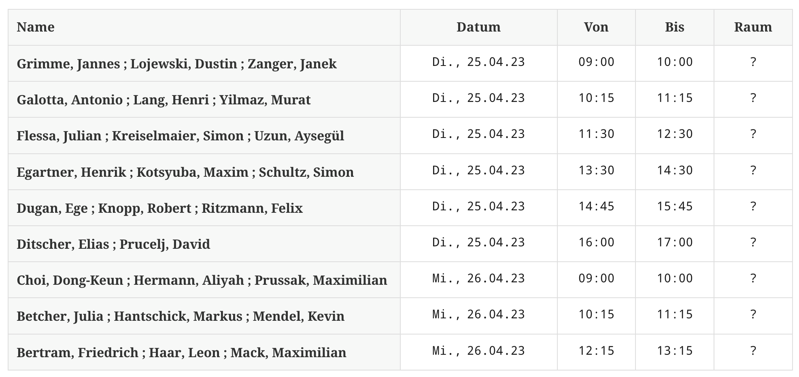

# Lehrveranstaltung Programmierung II

> **Titel**: Fortgeschrittene Programmierung II mit Java

> **Fachlicher Kontext**: Zugbetrieb, Zugüberwachung & -disposition


## Übersicht

```
Hochschule         : Duale Hochschule BaWü (Mannheim)
Fachbereich        : Studienbereich Wirtschaft, 
                     Wirtschaftsinformatik, Application Management
Lehrveranstaltung  : Programmierung II (W3WI_109)
Lehrform           : Seminar mit Übungen
Prüfungsleistung   : Schriftliche & mündliche Prüfung
Dozent             : Thorsten Eckstein
```

## Prüfungsleistungen

Die gesamte Prüfungsleistung beinhaltet *zwei Teile*. Beide Leistungen ergeben zusammen das Gesamt-Prüfungsergebnis.

Die Teile sind:

1. Schriftliche *Prüfung* (Test auf Papier oder am Rechner) über die Inhalte der Lehrveranstaltungen von Herrn Hüchting & Herrn Eckstein, Dauer `30 min`

2. Mündliche *Prüfung* in `3er`-Gruppen mit einer Dauer von insgesamt `30 min`.

Die beiden *Prüfungsleistungen* werden separat bewertet (benotet) und gehen zur Hälfte in die Gesamtnote ein.

Weitere Informationen dazu folgen, sobald die Planung der Prüfungen endgültig festgelegt wurde.

<!--

### Abschlussprüfung

Die *mündlichen Abschlussprüfungen* finden nach derzeitigem Planungsstand an folgenden Tagen statt:

**ddd, dd.mm.2024**

und

**ddd, dd.mm.2024**

Die Prüfungen sind in `3er-Gruppen` organisiert und auf diese Tage verteilt. Die *Zusammensetzung* der Gruppen wird vorher bekannt gegeben (siehe unten).

Die Abschlussprüfung umfasst *Inhalte* aus beiden Lehrveranstaltungen:

1. _Algorithmen & Datenstrukturen_ (Herr Hüchting)
2. _Fortgeschrittenen Programmierung mit Java_ (Herr Eckstein)

### Zeitliche Planung

Die nachfolgende Tabelle enthält die *zeitliche Planung* zur Durchführung:



[cols="5h,^2m,^1m,^1m,^1m"]
|===
| Name	| Datum	| Von	| Bis	| Raum

| group #1	| dd., dd.mm.2024	| 09:00	| 10:00	| room

|===

_Viel Spaß und viel Erfolg!_

-->
