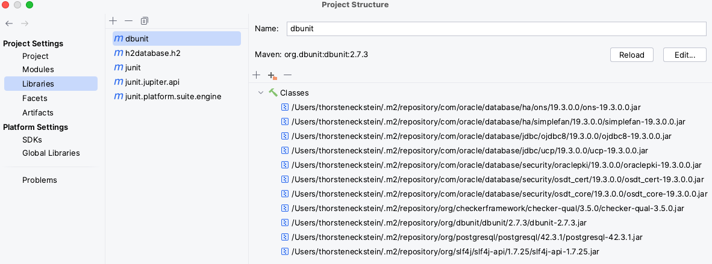
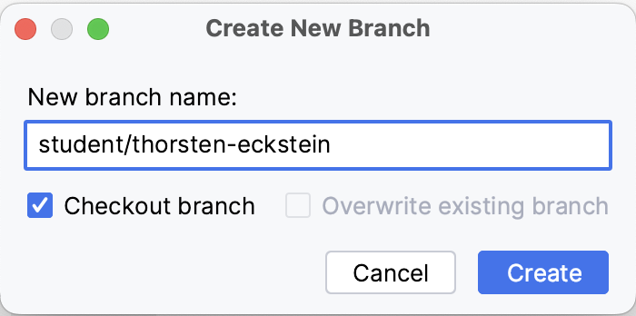

include::../settings.adoc[]

== How To's

=== Setup IntelliJ IDE

Adding project libraries/dependencies:

. Open project structure
. Click `Libraries` on the left
. Click `+` to add a library
. Choose _"Maven ..."_ as dependency source
. Specify the (exact, full) dependency path, like ...

 org.junit.platform:junit-platform-suite-engine:1.9.1

. Select all modules to add the dependency to, here most often "course 1 - 12"
. When finished, the libs shall contain those as shown in the figure below

.Project Libraries (all loaded from "Maven Central")

=== Duplicate a new IntelliJ module on the base of another module

Follow these steps to create a new module in an IntelliJ project, here for example `Programmierung-II-W3WI-109`. Created module shall be named `course-2` as an example, using the settings of `course-1`:

. Open project dialog:

 File > Project Structure ...

. Select project modules in the dialog:

 Project Settings > Modules

. Add a new module using the `+` sign, specify a unique name, for example `course-2`.

. Accept settings as proposed by clicking `Create`. The new module now appears in the project view!

. Open the `iml` file from `course-1.iml` as the source for settings. Copy the full file contents simply into the previously created new module file, here `course-2.iml`. Save and exit.

. Optional: Simply copy `/src` and maybe also `/test` directories if you want to have existing code in the new module.

The new module now has (code and) settings of the source module!

=== Setup VSCode IDE

Basic *setup* steps:

. Open `VSCode` on your local machine
. Use `Explorer` to open your local Java workspace, e.g.

 <path-to-your-root-dir>/Programmierung-II-W3WI-109

. You should now see all "course" folders, but let's check required prerequisites & extensions first

. *Java Runtime Environment*, click `Manage > Command Palette` and search & click `Java: Configure Java Runtime`

. If not already selected, choose your locally installed Java (`17`) runtime using the `edit` button under `Java Versions`

NOTE: [small]#Alternatively, edit your `settings.json` file directly by opening menu `Code > Preferences > Settings` and switch to tab `Workspace`, then search for i.e. "_Runtime_" and click on `Java > Configuration: Runtimes` to get to the `settings.json` file. Pay *attention* to the different tabs for "user" and "workspace"!#

[start=6]
. *Extensions*: To get a sophisticated Java environment, extend VSCode with some extensions, the recommended are:

.. Documentation: Asciidoc
.. Coding: Extension Pack for Java, which bundles the following (Debugger for Java, Project Manager for Java, Test Runner for Java, Maven for Java)
.. Quality Assurance: IntelliCode
.. Quality Assurance: Language Support for Java(TM) by RedHat

To be able to create and display *UML diagrams*, you'll need:

[start=7]
. PlantUML (for diagrams)
. Graphviz (dot) language support for Visual Studio (for diagrams)

And finally, in case of problems:

[start=8]
. Check if *tests* are working simply by executing any unit test file via the `play` button, that is displayed on every unit test class as well as on each of its test methods

. If there are any *compilation* problems, that may be caused by missing *classpath configuration*. To fix this, click `Manage > Command Palette` and search `Java: Configure Classpath`, then add - if not already done - `/src` and `/test` folders of each course module.

NOTE: [small]#Like above, see also the file `.vscode/settings.json` that shows which classpath entries to add, so that the modules can "see" code of other modules.#

=== Git Lifecycle Commands

*git version*

Eine Prüfung, ob `git` installiert ist, geht am besten im Kommandozeilen Tool mittels

 git --version

was zum Beispiel folgende Ausgabe ergibt: `git version 2.39.1`

*git clone*

Ein Repository muss initial "geklont", d.h. heruntergeladen werden. Dadurch entsteht ein lokales Arbeitsverzeichnis bzw. eine Kopie des Remote Repositories:

:myrepo: https://github.com/ThorstenEckstein/dhbw-advanced-programming.git
:mybranch: hands-on

[subs="normal"]
----
 git clone [red]#<url-to-repo.git># -b [blue]#<branch-to-clone>#
----
[small]#_(-> siehe Kurstag 1)_#

*git branch*

Zur Prüfung, auf welchem _Branch_ man sich aktuell lokal (!) befindet, wechselt man in das geklonte Verzeichnis des Repositories und gibt ein:

 git branch

Hier sollte jetzt etwas Ähnliches erscheinen:

----
 * <branch-name>
----

Das Sternchen `*` markiert den _aktuell bearbeiteten Branch_.

*git pull*

Die Aktualisierung des lokalen Arbeitsverzeichnisses (lokales Repository) erfolgt entweder mithilfe der IDE im Menü oder GIT Icon oder durch das Kommando

 git pull

innerhalb des zu aktualisierenden, lokalen Repositories.

*Ein eigener Branch für die Übungen*

Um "_seine/ihre_" eigenen, lokalen Änderungen oder Implementierungen im "remote" Repository online zu speichern, *MUSS* man einen separaten, eigenen Branch erzeugen, bevor man Änderungen vornimmt!

CAUTION: [red]#_ACHTUNG: Lokale Änderungen dürfen zwar im Branch `hands-on` vorgenommen, aber nicht in das "remote" Repository mit `git push` übertragen werden!_#

Ein _eigener Branch_ kann hier helfen, damit man seine eigenen Experimente ohne Konflikte mit den Kursunterlagen zu verursachen durchführen kann. Das geht recht einfach mithilfe von `IntelliJ`, und zwar im Menü

`Git > New Banch ...`

woraufhin der Name des neuen Branches angegeben werden muss:

Idealerweise nutzt man zur Benennung folgende Konvention, wie im Screenshot auch schon zu sehen ist:

 student/<your-name>

*git commit*

Zur Speicherung von lokalen Änderungen im "lokalen" Repository nutzt man am besten die IDE im Menu durch `"Commit ..."` oder die Kommandozeile

 git add .
 git commit - m "commit-message"

*git push*

Übertragung der lokalen Änderungen (die vorher "committed" wurden), in das "remote Repository" online durch die IDE mit `"Push ..."` oder in der Kommandozeile mittels

 git push

WARNING: Für das `pushen` immer beachten, dass dies nur in einem eigenen Branch erlaubt ist!