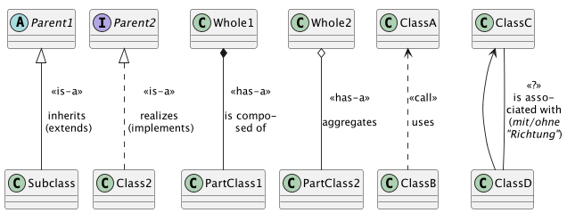
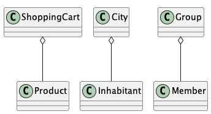
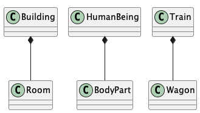

include::../../docs/settings.adoc[]
include::module-settings.adoc[]
:author: Thorsten Eckstein

// table of contents
:toc:

////
  Folgendes wird in "course-structure.adoc"
  aus jedem Modul zusammengeführt:

tag::content[]
----
1. Assoziationen
1.1. Beziehungsarten
1.2. Aggregation & Komposition
1.3. Navigierbarkeit
1.4. One-to-One-Assoziation
1.5. One-to-Many-Assoziation
1.6. Many-to-Many-Assoziation
----
end::content[]
////

== Assoziationen

Klassen existieren fast nie unabhängig, denn Software besteht immer auch vielen Klassen und weiteren Datenstrukturen, die nur *gemeinsam* funktionieren und somit die ganze Software bilden.

=== Beziehungsarten

Klassen gehen also mit anderen Klassen viele sogenannte *"Beziehungen"* ein. Dabei gibt es verschiedene Arten von Beziehungen. Die wichtigsten sind:

* *Aufruf* (_dynamische Beziehung zur Laufzeit_), kann innerhalb einer Software sein oder zwischen ganzen Systemen!
* *Vererbung*, *Realisierung* (_statische Beziehung zur Compilezeit_)
* *Besitz* (_statische Beziehung zur Compilezeit_) -> wird (neben weiteren Varianten) oft auch als *Assoziation* bezeichnet.

Vielfach wird bzgl. der Beziehungen zwischen Klassen zwischen folgenden zwei grundsätzlichen Varianten unterschieden:

. `*is-a*` - Klasse A _ist eine_ Klasse vom Typ B => "Vererbung"
. `*has-a*` - Klasse A _hat eine_ Klasse B => "Zusammensetzung"

Zusammengefasst als Übersicht:

////
[plantuml, "coupling", png, align="center"]
....
include::diagrams/associations.puml[]
....
////

==== Kopplung

====
Art & Grad der Abhängigkeit *zwischen* (einzelnen) Softwaremodulen, insb. Klassen.
====

[plantuml, "coupling", png, align="center", title="Kopplung"]
....
include::diagrams/coupling.puml[]
....

Die *Kopplung* im obigen Diagramm ist die (Art und) *Anzahl der Pfeile* zwischen den Klassen. Sie gibt an, wie stark die einzelnen Programmmodule (hier Klassen) von den anderen abhängig sind. Wechselwirkungen zwischen zwei Klassen/Objekten treten auf, weil es eine Kopplung gibt. Lose gekoppelte Programme sind flexibel und erweiterbar, je stärker die Kopplung, desto schwieriger wird die Änderbarkeit der Klassen.

==== Kohäsion

====
Grad des Zusammenhangs (z.B.) von Klassen *innerhalb* eines Moduls/Pakets.
====

[plantuml, "cohesion", png, align="center", title="Kohäsion (hier z.B. im rot hinterlegten Paket)"]
....
include::diagrams/cohesion.puml[]
....

*Kohäsion* misst, wie stark die einzelnen Klassen innerhalb eines Programmmoduls - z.B. eines Paketes - zusammenhängen, vor allem wie stark sie zu _einem/wenigen_ Aspekt oder auch Zusammenhang gehören. Gut *strukturierte* Software führen oft zu stark zusammenhängenden Anwendungen.

IMPORTANT: _Der Grad - also die Anzahl und Qualität - der Summe aller dieser Beziehungen zwischen den Klassen einer Software wird unter dem Begriffspaar *Kopplung & Kohäsion* zusammengefasst (*"loosely coupled along with high cohesion"*). Ein allgemeines Qualitätsziel von Software ist bspw., einen niedrigen Grad von Kopplung der Komponenten zu erreichen. Je geringer die Kopplung ist, desto besser ist die Software änderbar. Gleichzeitig sollen die Klassen innerhalb eines Paketes/Moduls zur gleichen Fachlichkeit gehören!_

*Beispiel:*

Die *Organisation dieser LV* ist so aufgebaut. Es gibt viele einzelne Module, in denen Klassen enthalten sind, die eben zu diesem Modul bzw. zu dem jeweiligen Thema gehören (_"hoch kohäsiv"_).

Gleichzeitig haben die Module untereinander keine bzw. sehr wenige Abhängigkeiten (_"loose gekoppelt"_)

=== Aggregation & Komposition

Assoziationen können auch *qualitativ und semantisch* recht unterschiedlich sein. In diesem Zusammenhang sind *Aggregation* und *Komposition* von Bedeutung.

==== Aggregation

Die Aggregation, sowie auch die Komposition, ist eine Assoziation von *Teilen zu einem Ganzen*. Jedes Teil ist zu dem Ganzen mit einer Assoziation "ist-teil-von" (part-of) verbunden.

Ein paar Beispiele dazu:

////
[plantuml, "aggregation", png, align="center"]
....
include::diagrams/aggregation.puml[]
....
////

Demo:
[subs=normal]
 {mod-ref-test}/demo/AssociationsDemoTest.demo1()

==== Komposition

Der Unterschied einer Komposition zur Aggregation ist, dass die Teile, die ein Objekt enthält, von dem Ganzen *existentiell abhängig* sind.

Ein paar Beispiele dazu:

////
[plantuml, "composition", png, align="center"]
....
include::diagrams/composition.puml[]
....
////

Die Unterschiede sind also fein, aber wichtig.

====
_Es stellt sich außerdem die Frage, wie man so eine *"existentielle Abhängigkeit"* im Code ausdrücken könnte?_
====

*Demo:*

[subs=normal]
 {mod-ref-test}/demo/AssociationsDemoTest.demo2()

=== Navigierbarkeit

Sobald Klassen durch Assoziationen verbunden werden, kommt der Aspekt der *Navigierbarkeit* (von Instanz zu Instanz) hinzu, d.h. man überlegt, welche Klasse welche als Attribut enthält und ob auch die assoziierte Klasse etwas über diese Beziehung weiß.

Letztlich drückt sich die Navigierbarkeit darin aus, ob assoziierte Klassen

* als Attribut mit `Typ` -> (2) oder
* nur als `Id` in Form eines primitiven Datentyps -> (3)

vorhanden sind. Auch die "besitzende" Klasse hat in aller Regel selbst eine ID -> (1).

Am Beispiel:

[, java]
----
public class Train {
    public long id; <1>
    public Locomotive locomotive; <2>
    public long locomotiveId; <3>
}                           |
                            |
public class Locomotive {   |
    public long id; <-------+
    public Train train; // ist das hier sinnvoll?
}
----

=== One-to-One-Assoziation

Siehe Unit-Test:
[subs=normal]
 {mod-ref-test}/demo/AssociationsDemoTest.demo3()

Ein Beispiel::
_Jede natürliche Person besitzt *genau* einen Personalausweis, der Ausweis kann verloren gehen, die Person kann sterben, dann muss aber auch der Personalausweis vernichtet werden, das wurde oben bereits demonstriert._

Es geht hier also oft um die Überlegung zur *Semantik bzw. Qualität* einer Beziehung zwischen zwei abhängigen Objekten!

=== One-to-Many-Assoziation

Ein Beispiel für eine Eins-zu-Viele Beziehung:

[plantuml, "one-to-many", png, align="center"]
....
include::diagrams/one-to-many-example.puml[]
....

TIP: _Man beachte immer auch die Richtung der Pfeile, die in aller Regel etwas über die *Lesart* und *Navigierbarkeit* aussagt!_

Zugehörige Unit-Tests zur *Demonstration*:

[subs=normal]
 {mod-ref-test}/demo/AssociationsDemoTest.demo4a()
 {mod-ref-test}/demo/AssociationsDemoTest.demo4b()

sowie Implementierungen für V1 und V2:

[subs=normal]
 {mod-ref-src}/demo/associations.[red]#*n*#.*.java

-> Übung 1

=== Many-to-Many-Assoziation

Die folgenden zwei Varianten kommen am häufigsten vor:

[plantuml, "many-to-many", png, align="center"]
....
include::diagrams/many-to-many-example-2.puml[]
....

////
Gegenstand der Übungen!

Implementierungsbeispiele:
[subs=normal]
 {mod-ref-src}/demo/associations.n
 {mod-ref-src}/demo/associations.nm

Zugehörige Unit-Tests:
[subs=normal]
 {mod-ref-test}/demo/AssociationsDemoTest.demo3()
////

Assoziationen zwischen Java Klassen werden manchmal auch als *Relationen* bezeichnet. Dieser Begriff stammt aus dem Umfeld der *Datenbanken*, meint aber das Gleiche. Dies ist ein optionales Thema und kann bei Gelegenheit eingeschoben werden.

*Übungen*:

Die *Übungen* sollen in Form von *Unit-Tests* in folgendem _Package_ implementiert werden:

[subs=normal]
 {mod-ref-test}/exercises/AssociationsExerciseTest.java

Die *Testobjekte*, also die _echten_ Klassen, Interfaces oder anderer Sourcecode wie zuvor auch in:

[subs=normal]
 {mod-ref-src}/exercises

Übung 1::

Erstelle zwei Klassen

* `Course` und
* `Student`

Der Kurs kann von *mehreren* Student:innen besucht werden. Setze diese Beziehung zwischen den beiden Klassen in der Klasse `Course` um.

Überlege hier auch, welcher *Listentyp* sich dafür am besten eignet.

Übung 2 (optional)::

Umsetzung des Prinzips *Information Hiding*

In dem folgenden Paket finden sich die Klassen aus der Demonstration:

[subs=normal]
 {mod-ref-test}/demo/associations.nm.v2

Diese Klassen enthalten aber noch keine Methoden!

Füge die zu den Attributen gehörenden `getter` und `setter` Methoden hinzu und passe auch den zugehörigen Unit-Test entsprechend an. Der findet sich hier:

[subs=normal]
 {mod-ref-test}/demo/AssociationsExerciseTest.exercise2()

////
Testfragen::
Im Modul `/exam` finden sich weitere kleine Übungen für die Inhalte des Kurses 2, und zwar in der dortigen Testklasse:

[subs=attributes]
 {course-2-exam}/ExamTest.java
////

