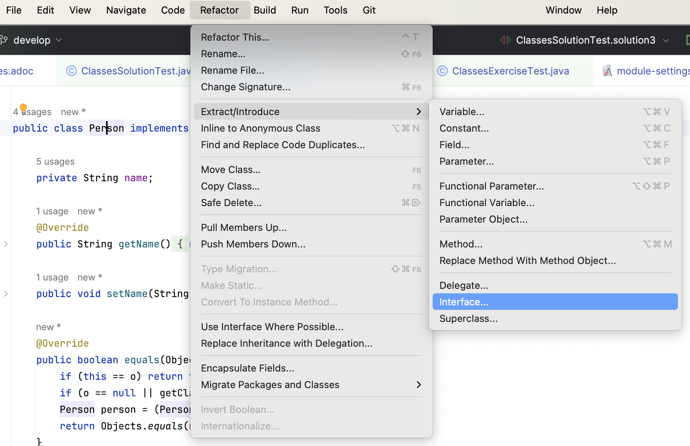

include::../../docs/settings.adoc[]
//include::module-settings.adoc[]
:author: Thorsten Eckstein

// table of contents
:toc:

////
  Folgendes wird in "course-structure.adoc"
  aus jedem Modul zusammengeführt:

tag::content[]
----
1. Organisation & Nutzung von Java Klassen
2. Klassen & Instanzen
3. Vererbung
4. Überladen & Übersteuern (Überschreiben)
5. Polymorphismus
----
end::content[]
////

== Organisation & Nutzung von Java Klassen

*Organisation*

Die Ablage bzw. Speicherung eine Java Klassen in Form von Dateien erfolgt in Verzeichnissen, die ihrerseits hierarchisch angelegt werden (können aber nicht müssen). Im Kontext von Java werden diese Ablageverzeichnisse *Packages* genannt. Der Java Compiler registriert den Ablageort einer Java Klasse, indem in dieser ganz zu Beginn das Schlüsselwort

 package

genutzt wird, zusammen mit der voll-qualifizierten Verzeichnis-Hierarchie unter Nutzung von Punkten als Trennzeichen, also etwa

 package de.dhbw.domain.model;

Die _Eindeutigkeit_ einer Java Klassen ergibt sich also nicht "allein" aus ihrem Namen der Klassensignatur, sondern nur in Verbindung mit dem package, in dem sie sich befindet. Beides ergibt den sog. *voll-qualifizierten Klassen-Namen*, etwa

 de.dhbw.domain.model.Train

*Importierung (Nutzung)*

Wenn eine Java Klasse in/von einer anderen genutzt werden soll, muss sie zuerst *importiert* bzw. *bekannt gemacht* werden. Dazu muss sie mit ihrem _voll-qualifizierten Namen_ (s.o.) ganz am Anfang der Datei angegeben werden. Das Package entspricht dabei dem Verzeichnis, in dem die Datei abgelegt ist. Dazu dient das *Schlüsselwort*

 import

wie im folgenden Beispiel zu sehen:

[, java]
----
package de.dhbw.demo.model; <1>

import java.util.List; <2>

public class MyClass {
   // Inhalte der Klasse weggelassen ...
}
----
<1> Angabe des Speicherorts der Java Klasse
<2> Importierung von anderen Java Klassen, häufig aus "Bibliotheken"

== Klassen & Instanzen

[ <<about_classes,Inhalt>> | <<demos_classes,Demo>> | <<exercises_classes,Übungen>> ]

[[about_classes]]
Kurz etwas *Theorie* vorab bzw. zur Wiederholung:

Unter einer *Klasse* (oder Objekttyp, -><<ref-1,Ref. 1>>) versteht man in der objektorientierten Programmierung ein abstraktes Modell bzw. einen Bauplan für eine Reihe von ähnlichen Objekten.

Die Klasse dient als Bauplan für die Abbildung von realen Objekten in Softwareobjekte und beschreibt Attribute (Eigenschaften, Felder) und Methoden (Verhaltensweisen) der Objekte. Etwas allgemeiner kann auch gesagt werden, dass eine Klasse dem *Datentyp eines Objekts* entspricht.

Eine Java Klasse hat in der Regel folgende Bestandteile:

* Eigenschaft (Feld),
* Konstruktor und
* Verhaltensweise (Methode):

Die wichtigsten Elemente von Java:

Die *Klassensignatur* selbst:

[source,java]
----
public class MyClass {

}
----

Eine Klasse mit einem *Feld* bzw. einer Eigenschaft:

[source,java]
----
public class MyClass {

    public String field;

}
----

Eine Klasse mit (Default-) *Konstruktor*:

In Java spielen die Konstruktoren eine wichtige Rolle bei der Erstellung und Initialisierung von Objekten. Sie sind spezielle Methoden, die aufgerufen werden, wenn ein neues Objekt erstellt wird, und ermöglichen es, das Objekt mit bestimmten Werten oder Eigenschaften zu initialisieren.

[source,java]
----
public class MyClass {

    public MyClass() {
        super();
    }

}
----

Die

* *Initialisierung* eines Objektes bzw. die
* *Instanziierung* einer Klasse

erfolgt in Verbindung mit dem Schlüsselwort `new` wie folgt:

[source,java]
----
MyClass myClazz = new MyClass();
----

Eine Klasse mit einer *Methode* bzw. einer Verhaltensweise:

[source,java]
----
public class MyClass {

    public String doSomething() {
        return "result";
    }

}
----

[[demos_classes]]
*Demo*:

[subs=normal]
 -> {mod-ref-test}/demo/classes/ClassesDemoTest.java

[IMPORTANT]
====
Einschub: Zur Theorie des -> <<tdd,Test Driven Developments>>, dann kehren wir zur Übung zurück!
====

[[exercises_classes]]
*Übungen*:

[subs=normal]
 -> {mod-ref-test}/exercise/classes/ClassesExerciseTest.java

Erzeuge ein erstes, kleines *Klassenmodell*:

Übung 1::

- Eine Klasse `Fernzug` mit einem parameterlosen Konstruktor
- Eine Klasse `Regionalzug` mit einem parameterlosen Konstruktor
- Einen Test, der die korrekte Instanziierung der Instanzen bestätigt

Übung 2::

- Ergänze die Klasse Zug mit einem Feld namens "number". Erzeuge eine Instanz und teste für die Instanz, welchen Wert dieses Feld einer Instanz hat!

Übung 3::

Was fällt bei den Implementierungen besonders ins Auge?

== Vererbung

[ <<about_inheritance,Inhalt>> | <<demos_inheritance,Demo>> | <<exercises_inheritance,Übungen>> ]

[[about_inheritance]]
Bei der *Vererbung* in Java wird zwischen einer *Super*- und einer *Subklasse* unterschieden.

Die _Superklasse_, auch Eltern- oder Basisklasse genannt, ist vielfach eine Zusammenfassung von allgemeinen Attributen und Methoden unterschiedlicher aber ähnlicher Objekte (*Verallgemeinerung*).

Die _Subklasse_, auch Kind- oder Unterklasse bezeichnet, bekommt von ihrer Elternklasse sämtliche Attribute und Methoden vererbt, die nicht `private` sind. Des Weiteren kann die Subklasse um eigene Attribute und Methoden erweitert werden. Man spricht hier von einer *Spezialisierung* der Subklasse von der Superklasse.

Eine Vererbung in Java findet über das Schlüsselwort

 extends

statt. Der zugehörige Quellcode:

[source,java]
----
public class SuperClass { }

public class SubClass extends SuperClass { }
----

Die _grafische_ Darstellung der Vererbung sieht folgendermaßen aus:

[plantuml, title="Inheritance", png, align="center"]
....
include::diagrams/inheritance.puml[]
....

== Everything extends Object

An dieser Stelle ggf. Referenz auf `module-object-contract`

[[demos_inheritance]]
*Demo*:

[subs=normal]
 -> {mod-ref-test}/demo/inheritance/InheritanceTest.java

== Überladen & Übersteuern (Überschreiben)

[source,java,title="Beispiel Überladen von Methoden"]
----
include::{mod-lnk-src}/demo/overload/PlatformDisplay.java[lines="5..16"]
----

[plantuml, "overrides", png, float="left"]
....
include::diagrams/override.puml[]
....

[source,java,title="Beispiel Übersteuern von Methoden"]
----
include::{mod-lnk-src}/demo/override/Display.java[lines="2..5"]
----

{nl}
{nl}
{nl}

Die zugehörige Annotation im Code ist

 @Override

Sie sollte in jedem Fall genutzt werden, zudem wird sie auch von der IDE vorgeschlagen

Die zugehörigen *Unit-Tests* finden sich hier:

 -> src/test/java/de/dhbw/demo/OverloadAndOverrideTest.java

== Polymorphismus

Die Methoden einer Klasse können der sogenannten *Polymorphie* unterliegen. Polymorphie ist griechisch und bedeutet Vielgestaltigkeit. Von Polymorphie spricht man in Java beispielsweise, wenn zwei Klassen denselben Methodennamen verwenden, aber die Implementierung der Methoden sich unterscheidet.

Häufig wird Polymorphie bei der Vererbung verwendet, d.h., dass einer Variablen nicht nur Objekte vom Typ der bei der Deklaration angegebenen Klasse zugewiesen werden können, sondern auch Objekte vom Typ der Kind-Klassen. Dies funktioniert nur, weil jede Kind-Klasse auch alle Methoden und Attribute ihrer Elternklassen implementieren muss.

Damit ist gewährleistet, dass alle Kind-Klassen über dieselben Methoden verfügen wie die Elternklasse. Die Methoden können jedoch unterschiedlich implementiert werden, man spricht hier vom "Überschreiben" oder "Übersteuern" (engl. "*Override*") der Methode (mehr dazu folgt in einem späteren Modul).

[[demos_polymorphism]]
*Demo*:

[subs=normal]
 -> {mod-ref-test}/demo/inheritance/InheritanceDemoTest.java

In diesem Zusammenhang sind auch die Schlüsselwörter `super` und `this` von Bedeutung:

* `super`: Referenz für Felder oder Methoden der *Super-Klasse*
* `this`: Referenz für Felder oder Methoden aus der *eigenen Klasse*

*Fragen*:

. _Warum kann Vererbung sinnvoll sein?_
. _Wozu kann Polymorphismus nützlich sein?_

[[exercises_inheritance]]
*Übungen*:

====
TIP: Nutze, wann immer möglich, `Code Generierung` für die Schritte, am besten mithilfe der Tastenkombination.
====

[%collapsible, title="_Zur Erinnerung > Auszug aus 'Tools & Help...'_"]
====
include::../../module-tools-n-help/docs/tools-and-help.adoc[tag="code-generation-keys"]
====

_Testklasse_, in der die Übungen implementiert werden können:

[subs=normal]
 -> {mod-ref-test}/exercise/inheritance/InheritanceExerciseTest.java

Übung 1::

Erstelle *Klassen* im Paket

 java/de/dhbw/exercise/classes

 . Erstelle eine neue Klasse `Fernzug` mit einem parameterlosen Konstruktor
 . Erstelle eine neue Klasse `Regionalzug` mit einem parameterlosen Konstruktor
 . Teste, ob die Instanzen korrekt erzeugt wurden!

Übung 2::

Übung zu *Syntax, Klassenmodell* und erforderliche *Methoden*.

* Eine Klasse `Zug` mit
** einem String Feld `number` und
** einer Methode `getNumber()`, die den Wert des gleichnamigen Feldes zurückgibt
* Eine Klasse `Fernzug`, die von der Klasse `Zug` erbt
* Ergänze die Klasse `Fernzug` mit einer beliebigen, deiner Meinung nach sinnvollen Spezialisierung
* Teste, welchen Wert das Feld `number` hat

Übung 3 _(optional_)::

Nutze die Test-Klasse

[subs=normal]
 {mod-ref-test}/exercise/classes/ClassesExerciseTest.java -> exercise3()

Übung zu *Syntax, Klassenmodell* und erforderliche *Methoden*.

Erzeuge eine

. konkrete Klasse `Person`
. mit einem Attribut `name`, erstelle dann
. die zum Attribut gehörende `get` und `set` Methode,
. erstelle außerdem die `equals()` und `hashCode()` Methoden durch Code Generierung,
. zuletzt leite aus dieser konkreten Klasse ein Interface `Mensch` ab

[%collapsible, title="_Hilfe zu 'Extract Interface ...'_"]
====

====

== Referenzen

[[ref-1]]
Ref. 1: https://de.wikipedia.org/wiki/Klasse_(Objektorientierung)[https://de.wikipedia.org/wiki/Klasse_(Objektorientierung)]
