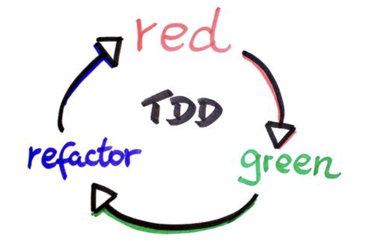
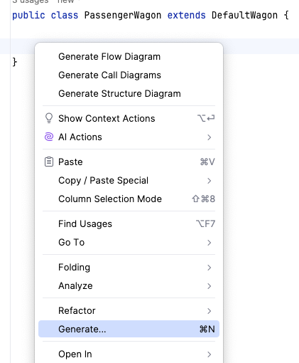
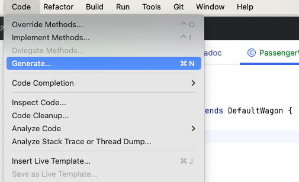
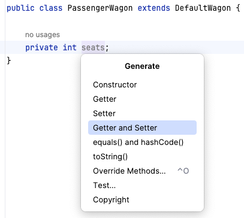
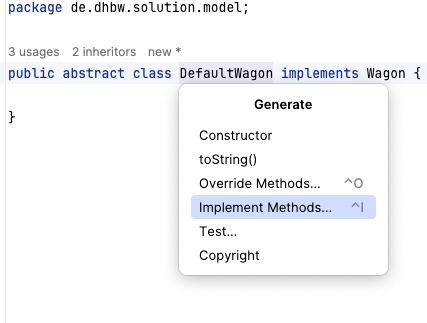

include::../../docs/settings.adoc[]
include::module-settings.adoc[]
:author: Thorsten Eckstein

:toc:

== Klassen & Objekte (Instanzen)

[ <<about_classes,Inhalt>> | <<demos_classes,Demo>> | <<exercises_classes,Übungen>> ]

[[about_classes]]
Kurz etwas *Theorie* vorab bzw. zur Wiederholung:

Unter einer *Klasse* (oder Objekttyp, -><<ref-1,Ref. 1>>) versteht man in der objektorientierten Programmierung ein abstraktes Modell bzw. einen Bauplan für eine Reihe von ähnlichen Objekten.

Die Klasse dient als Bauplan für die Abbildung von realen Objekten in Softwareobjekte und beschreibt Attribute (Eigenschaften, Felder) und Methoden (Verhaltensweisen) der Objekte. Etwas allgemeiner kann auch gesagt werden, dass eine Klasse dem *Datentyp eines Objekts* entspricht.

Eine Java Klasse hat in der Regel folgende Bestandteile:

* Eigenschaft (Feld),
* Konstruktor und
* Verhaltensweise (Methode):

Die wichtigsten Elemente von Java:

Die *Klassensignatur* selbst:

[source,java]
----
public class MyClass {

}
----

Eine Klasse mit einem *Feld* bzw. einer Eigenschaft:

[source,java]
----
public class MyClass {

    public String field;

}
----

Eine Klasse mit (Default-) *Konstruktor*:

In Java spielen die Konstruktoren eine wichtige Rolle bei der Erstellung und Initialisierung von Objekten. Sie sind spezielle Methoden, die aufgerufen werden, wenn ein neues Objekt erstellt wird, und ermöglichen es, das Objekt mit bestimmten Werten oder Eigenschaften zu initialisieren.

[source,java]
----
public class MyClass {

    public MyClass() {

    }

}
----

Die Initialisierung eines Objektes erfolgt in Verbindung mit dem Schlüsselwort `new`:

[source,java]
----
MyClass myClazz = new MyClass();
----

Eine Klasse mit einer *Methode* bzw. einer Verhaltensweise:

[source,java]
----
public class MyClass {

    public String doSomething() {
        return "result";
    }

}
----

[[demos_classes]]
*Demo*:

[subs=normal]
 -> {mod-ref-test}/demo/classes/ClassesDemoTest.java

[IMPORTANT]
====
Einschub: Zur Theorie des -> <<tdd,Test Driven Developments>>, dann kehren wir zur Übung zurück!
====

[[exercises_classes]]
*Übungen*:

[subs=normal]
 -> {mod-ref-test}/exercise/classes/ClassesExerciseTest.java

Erzeuge ein erstes, kleines *Klassenmodell*:

Übung 1::

- Eine Klasse `Fernzug` mit einem parameterlosen Konstruktor
- Eine Klasse `Regionalzug` mit einem parameterlosen Konstruktor
- Einen Test, der die korrekte Instanziierung der Instanzen bestätigt

Übung 2::

- Ergänze die Klasse Zug mit einem Feld namens "number". Erzeuge eine Instanz und teste für die Instanz, welchen Wert dieses Feld einer Instanz hat!

Übung 3::

Was fällt bei den Implementierungen besonders ins Auge?

[[tdd]]
== Test-Driven-Development (`TDD`)

Test Driven Development (`TDD`) ist eine gute Praxis, um den Sourcecode von Beginn an - mithilfe von Unit-Tests regelmäßig und bei Änderungen auf Korrektheit zu überprüfen. Die erste Umsetzung erfolgt vielfach durch Testklassen, den `Unit-Tests`.

Unit-Tests haben folgende *Eigenschaften*:

. Unit-Tests sind *automatisiert*. Ein Unit-Test-Framework führt Tests aus, verifiziert und gibt das Ergebnis zurück, damit es geprüft werden kann
. Unit-Tests sind *granular*, sie sollen nur einen kleinen Teil des Codes -häufig eine Methode - testen.
. Unit-Tests *isolieren* das Testziel und sollen möglichst ohne oder nur mit wenig "Vorbereitungen" gestartet werden können
. Unit-Tests sind *deterministisch*, damit das Testergebnis sauber geprüft werden kann und wiederholt werden kann
. Unit-Tests sind *unabhängig*. Die Ausführung der Tests dürfen in keiner Weise von anderen Testmethoden abhängen, denn die Reihenfolge der vom Framework ausgeführten Tests ist zufällig bzw. nicht vorhersagbar.

*Umsetzung*:

Unit-Tests weisen eine besondere (innere) Struktur auf, d.h. die Art und Weise, wie diese geschrieben werden. Dazu zählen

* `given-when-then` oder
* `arrange-act-assert`.

*Vorgehensweise*:

Auch das Schreiben von Tests folgt vielfach einer Routine bzw. einer "best practice". Neben zahlreichen gleichwertigen Ansätzen ist die so-genannte `"red, green, refactor"` Methode weitestgehend anerkannt.

[small]#_Quelle:-> https://www.informatik-aktuell.de/entwicklung/methoden/tdd-erfahrungen-bei-der-einfuehrung.html[Informatik Aktuell]_#

*Red, Green, Refactor*:

Der "red, green, refactor" Ansatz hilft Entwicklern, den (zu implementierenden) Code zu entwickeln, indem sie den Fokus in den Phasen auf bestimmte Aspekte lenken:

. [red]#*Red*#: _Was soll implementiert werden und wie fühlt sich das Ganze aus Sicht des "Clients" bzw. der Nutzer an?_ Nutzer sind hier primär die Entwickler selbst bzw. diejenigen, die die Klassen, Methoden, Algorithmen im Code aufrufen, also nutzen wollen. In dieser Phase _soll_ der Test noch scheitern, d.h. "rot" sein, weil hier nicht die Implementierung an sich, sondern die "Außensicht" auf die `API` im Vordergrund steht.

. [green]#*Green*#: In dieser Phase geht es darum, den Test _"zum Laufen"_ zu bringen. Es wird also "grün". Im Vordergrund steht die _schnellste und einfachste Implementierung_ der Funktionalität. Der Code wird hier also nur technisch funktionsfähig gemacht, es werden aber so wenig wie möglich Überlegungen angestellt, wie der Code gut, schön oder effektiv geschrieben werden muss.

. [blue]#*Refactor*#: In dieser letzten Phase (dieser Iteration) geht es nun genau darum, was in den beiden vorherigen Phasen absichtlich nicht gemacht werden sollte, nämlich die Verbesserung des Codes hinsichtlich seiner "Qualität" (das Thema Code-Qualität wird gegen Ende des Seminars noch näher betrachtet). Ergebnis dieser (drei) Phasen soll dann ein Unit-Test sein, der lesbar und wartbar ist und auch die Implementierung der Funktionalität einen bestimmten Reifegrad bzw. eine erste hinreichende Qualität erreicht hat, und natürlich letztlich die korrekte Funktionalität liefert.

[[demos_tdd]]
Dazu eine *Demo*:

[subs=normal]
 -> {mod-ref-test}/demo/tdd/TddDemoTest.java

== Code Generierung mit der IDE (Autocompletion, Vorschlagswesen)

In aller Regel ist es sehr sinnvoll, die Entwicklungsumgebung (IDE) weitreichend zu nutzen. Das gilt insbesondere für die *Erzeugung von Quellcode*. Das Ganze ist grundsätzlich eine Sache der Übung, man sollte sich einfach daran gewöhnen, diese Hilfen möglichst viel als Entwickler:In zu nutzen!

Ein paar *Tipps* dazu:

*Generierung von Quellcode (Klassen, Methoden, etc.)*

. mithilfe einer *Tastenkombination*
.. unter MacOS: `Command + N`
.. unter Windows: `Alt + Einfg` (ggf. auch `FN + Alt + Einfg`) oder
. mithilfe der *Maus*

// grid="none", frame="none"
[cols="^1,^1", grid="none", frame="none"]
|===
| An der Cursorposition "Rechts-Klick" > `Generate ...`
| An der Cursorposition > IntelliJ-Menü `Code` > `Generate ...`

| 
| 
|===

Hier wählt man dann einfach die gewünschte *kontext-spezifische* Funktion:

[cols="^1,^1", grid="none", frame="none"]
|===

| z.B. die Generierung von Methoden _"Getter & Setter"_
| oder die Implementierung von Interface-Methoden

| 
| 
|===

== Vererbung & Polymorphismus

[ <<about_inheritance,Inhalt>> | <<demos_inheritance,Demo>> | <<exercises_inheritance,Übungen>> ]

[[about_inheritance]]
[big]#Vererbung#

Bei der *Vererbung* in Java wird zwischen einer *Super*- und einer *Subklasse* unterschieden.

Die _Superklasse_, auch Eltern- oder Basisklasse genannt, ist vielfach eine Zusammenfassung von allgemeinen Attributen und Methoden unterschiedlicher aber ähnlicher Objekte (*Verallgemeinerung*).

Die _Subklasse_, auch Kind- oder Unterklasse bezeichnet, bekommt von ihrer Elternklasse sämtliche Attribute und Methoden vererbt, die nicht `private` sind. Des Weiteren kann die Subklasse um eigene Attribute und Methoden erweitert werden. Man spricht hier von einer *Spezialisierung* der Subklasse von der Superklasse.

Eine Vererbung in Java findet über das Schlüsselwort

 extends

statt. Der zugehörige Quellcode:

[source,java]
----
public class SuperClass { }

public class SubClass extends SuperClass { }
----

Die _grafische_ Darstellung der Vererbung sieht folgendermaßen aus:

[plantuml, title="Inheritance", png, align="center"]
....
include::diagrams/inheritance.puml[]
....

[[demos_inheritance]]
*Demo*:

[subs=normal]
 -> {mod-ref-test}/demo/inheritance/InheritanceTest.java

[big]#Polymorphismus#

Die Methoden einer Klasse können der sogenannten *Polymorphie* unterliegen. Polymorphie ist griechisch und bedeutet Vielgestaltigkeit. Von Polymorphie spricht man in Java beispielsweise, wenn zwei Klassen denselben Methodennamen verwenden, aber die Implementierung der Methoden sich unterscheidet.

Häufig wird Polymorphie bei der Vererbung verwendet, d.h., dass einer Variablen nicht nur Objekte vom Typ der bei der Deklaration angegebenen Klasse zugewiesen werden können, sondern auch Objekte vom Typ der Kind-Klassen. Dies funktioniert nur, weil jede Kind-Klasse auch alle Methoden und Attribute ihrer Elternklassen implementieren muss.

Damit ist gewährleistet, dass alle Kind-Klassen über dieselben Methoden verfügen wie die Elternklasse. Die Methoden können jedoch unterschiedlich implementiert werden, man spricht hier vom "Überschreiben" oder "Übersteuern" (engl. "*Override*") der Methode (mehr dazu folgt in einem späteren Modul).

[[demos_polymorphism]]
*Demo*:

[subs=normal]
 -> {mod-ref-test}/demo/inheritance/InheritanceDemoTest.java

In diesem Zusammenhang sind auch die Schlüsselwörter `super` und `this` von Bedeutung:

* `super`: Referenz für Felder oder Methoden der *Super-Klasse*
* `this`: Referenz für Felder oder Methoden aus der *eigenen Klasse*

*Fragen*:

. _Warum kann Vererbung sinnvoll sein?_
. _Wozu kann Polymorphismus nützlich sein?_

[[exercises_inheritance]]
*Übungen*:

[subs=normal]
 -> {mod-ref-test}/exercise/inheritance/InheritanceExerciseTest.java

Übung 1::

Erzeuge folgende *Klassen*:

* Eine Klasse `Zug` mit
** einem String Feld `number` und
** einer Methode `getNumber()`, die den Wert des gleichnamigen Feldes zurückgibt
* Eine Klasse `Fernzug`, die von der Klasse `Zug` erbt
* Ergänze die Klasse `Fernzug` mit einer beliebigen, deiner Meinung nach sinnvollen Spezialisierung
* Teste, welchen Wert das Feld `number` hat

== Referenzen

[[ref-1]]
Ref. 1: https://de.wikipedia.org/wiki/Klasse_(Objektorientierung)[https://de.wikipedia.org/wiki/Klasse_(Objektorientierung)]
