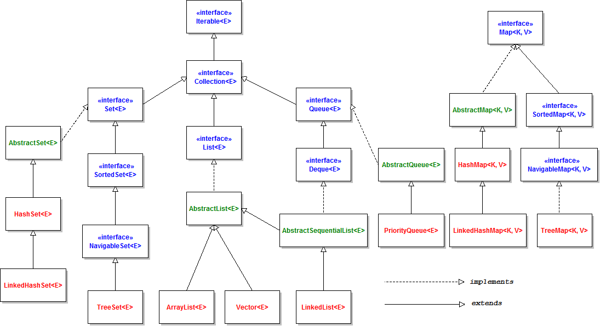

include::../../docs/settings.adoc[]
include::module-settings.adoc[]
:author: Thorsten Eckstein

// table of contents
:toc:

////
  Folgendes wird in "course-structure.adoc"
  aus jedem Modul zusammengeführt:

tag::content[]
----
1. Arrays
2. Collections
2.1. Java Collections API
2.2. Special Java Collections Classes
2.3. Synchronized Wrappers
2.4. Unmodifiable Wrappers
----
end::content[]
////

== Arrays

Laut Java-Dokumentation ist ein Array ein *Objekt, das eine feste Anzahl von Werten desselben Typs* enthält. Die Elemente eines Arrays sind indiziert, was bedeutet, dass mit Zahlen (sogenannten *Indizes*) auf sie zugegriffen werden kann.

Ein Array kann als eine nummerierte Liste von Zellen betrachtet werden, wobei jede Zelle eine Variable ist, die einen Wert enthält. In Java beginnt die Nummerierung bei (_Index_) `0`. Ein Array erkennt man an den *eckigen* Klammern `[]`.

[,java, subs=normal]
----
                       *Index*: {  0 ,  1 ,  2  , ... }
                                 :    :    :
String[] array = new String[] { "A", "B", "C" , ... };
----

Es gibt Arrays vom primitiven Typ und Arrays von komplexen Objekttypen. Das bedeutet, dass Arrays vom Typ `int`, `float`, `boolean` usw. verwendet werden können, aber auch Arrays vom Typ `String`, `Object` und benutzerdefinierte Typen.

Ein paar *Beispiele*:

[,java]
----
int[] arr1 = new int[4];             // feste Länge
int[] arr2 = new int[] {1, 2, 3, 4}; // mit initialen Werten
int[] arr3 = {1,2,3,4};              // ohne 'new'

String[] arr4 = new String[3];
String[] arr5 = new String[]{};
String[] arr6 = {"A", "xdre", "Frg%5"};
----

== Collections

Siehe z.B. -> https://en.wikipedia.org/wiki/Java_collections_framework[Java Collections Framework auf Wikipedia]

*Die wichtigsten Auswahlkriterien*:

* Position von Elementen (_numerischer index_)
* Möglichkeit zur Ordnung von Elementen (z.B. _insertion order_)
* Möglichkeit von `null` Elementen oder Duplikaten (_Set vs. List_)

CAUTION: -> _Duplikate in Listen? Wann ist ein Listenelement ein Duplikat? Technisch gleich oder logisch gleich?_

* Zugriff auf Elemente anhand eines Schlüssels (_List vs. Map_)

=== Java Collections API

Java collection interfaces are the foundation of the Java Collections Framework. All core collection interfaces are generic.
For example `public interface Collection<E>`. The <E> syntax is for Generics and when we declare Collection (_später mehr zum Thema_ `Generics`)

. *Collection interface*.
This is the root of the collection hierarchy. A collection represents a group of objects known as its elements. Some basic operations are provided.

. *Iterator Interface*.
Iterator interface provides methods to iterate over the elements of the Collection. Iterators allow the caller to remove elements from the underlying collection during the iteration.

. *Set Interface*
Set is a collection that cannot contain duplicate elements.
The Java platform contains three general-purpose Set implementations: HashSet, TreeSet, and LinkedHashSet.

. *List Interface*
List is an ordered collection and can contain duplicate elements. You can access any element by its index.
List has a dynamic length. ArrayList and LinkedList are implementation classes of List interface.

. *Queue Interface*
Queue is a collection used to hold multiple elements prior to processing.
Besides basic Collection operations, a Queue provides additional insertion, extraction, and inspection operations.
Queues typically, but do not necessarily, order elements in a FIFO (first-in-first-out) manner.

. *Dequeue Interface*
A linear collection that supports element insertion and removal at both ends. The name deque is short for "double-ended queue"

. *Map Interface*
Java Map is an object that maps keys to values. A map cannot contain duplicate keys, each key can map to at most one value.
The Java platform contains three general-purpose Map implementations: HashMap, TreeMap, and LinkedHashMap.

. *SortedSet Interface*
SortedSet is a Set that maintains its elements in ascending order. Sorted sets are used for naturally ordered sets.

. *SortedMap Interface*
A map that maintains its mappings in ascending key order. This is the Map analog of SortedSet.
Sorted maps are used for naturally ordered collections of key/value pairs.

TIP: Übrigens, das ist eine beliebte Prüfungsfrage: _"Welche Eigenschaften hat das Collections-Interface ...?"_

=== Special Java Collections Classes

Java Collections framework comes with many implementation classes for the interfaces. Most common implementations are:

. `HashSet` Class
. `TreeSet` Class
. `ArrayList` Class
. `LinkedList` Class
. `HashMap` Class
. `TreeMap` Class

=== Synchronized Wrappers

The *synchronization* wrappers add automatic synchronization (thread-safety) to an arbitrary collection.
Each of the six core collection interfaces - Collection, Set, List, Map, SortedSet, and SortedMap - has one static factory method, which return a synchronized (thread-safe) collection backed up by the specified collection.

=== Unmodifiable Wrappers

*Unmodifiable* wrappers take away the ability to modify the collection by intercepting all the operations that would modify the collection
and throwing an `UnsupportedOperationException`.

Its main usage is:

- To make a collection immutable once it has been built
- To allow certain clients read-only access to data structures (keep a reference to the backing collection but hand out a reference to the wrapper)
- To avoid `ConcurrentModificationException`

*Demos*:

Zu finden in:

[subs=normal]
 -> {mod-ref-test}/demo/CollectionsDemoTest.java

* Demo 1: Eine einfache Liste mit 'primitiven' Werten
* Demo 2: Eine einfache Liste mit 'komplexen' Werten (Objektinstanzen)
* Demo 3: Key-Value-Paare mit Maps
* Demo 4: Un-/Sortierte Map
* Demo 5a: Un-/Modifiable Lists
* Demo 5b: Un-/Modifiable Lists (alternative Implementierung)

*Übungen*:

Die *Übungen* sollen in Form von *Unit-Tests* in folgendem _Package_ implementiert werden:

[subs=normal]
 -> {mod-ref-test}/exercise/CollectionsExerciseTests.java

Die *Testobjekte*, also die zu bearbeitenden Klassen, Interfaces oder anderer Sourcecode sollen getrennt, nämlich hier umgesetzt werden:

[subs=normal]
 {mod-ref-src}/exercise

Übung 1::

*Listen*: Schreibe einen Test, in dem eine konkrete Implementierung von `List` und den Datentyp `Integer` benutzt wird. Befülle diese mit beliebig vielen Einträgen. Summiere alle Listeneinträge mithilfe einer `for-each` Schleife und teste das Ergebnis.

Übung 2::

*Maps*: Schreibe einen Test, in dem eine konkrete Implementierung von `SortedMap` benutzt wird. Befülle diese mit mindestens 5 Einträgen, nutze dazu `String` sowohl für den Schlüssel (K) also auch für den Wert (V). Überprüfe die Haupt-Charakteristik _"natürliche Sortierung"_ dieses Map-Typs.

////
Testfragen::
Im Modul `/exam` finden sich weitere kleine Übungen für die Inhalte des Kurses 2, und zwar in der dortigen Testklasse:

[subs=attributes]
 {course-2-exam}/ExamTest.java
////
