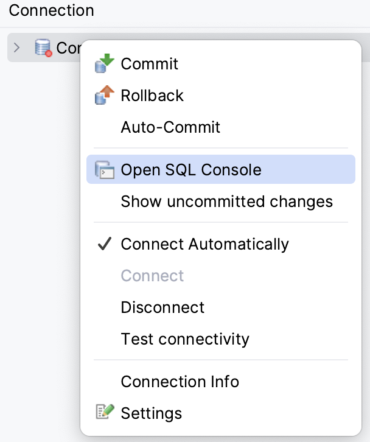

include::../../docs/settings.adoc[]
include::module-settings.adoc[]
:author: Thorsten Eckstein

// table of contents
:toc:

////
  Folgendes wird in "course-structure.adoc"
  aus jedem Modul zusammengeführt:

tag::content[]
----
1. Datenbank Programmierung
1.1. Preparation
1.2. Setup H2 Database
1.3. Theorie & Einführung
1.3.1. SQL-Datenbanken
1.3.2. Structured Query Language (SQL)
1.3.3. NoSQL-Datenbanken
1.3.4. SQL oder NoSQL?
1.3.5. ORM Objektrelationales Mapping
1.3.6. JPA - Jakarta Persistence API
----
end::content[]
////

== Datenbank Programmierung

=== Preparation

include::../../docs/includes/update-project.adoc[]

[[SETUP_H2_DATABASE]]
=== Setup H2 Database

NOTE: Grundsätzliches zur H2 Datenbank -> http://www.h2database.com/html/features.html[h2database.com]

. *PlugIn* installieren (bereits am Kurstag 1 erfolgt)
. Die *View* `DB Browser` aktivieren, im Menü `View > Tool Windows > DB Browser` (kann noch am rechten Rand von IntelliJ angesiedelt werden mit Rechtsklick auf das Symbol und _Move to ..._)
. *Hinzufügen* einer Datenbankverbindung: Klick auf das `+` Plus-Symbol
. Dazu folgende *Connection Settings* nutzen und Verbindung testen mithilfe des Buttons `Test Connection`:

[start=5]
. Connection einmal testen mit `Test Connection`, sollte ein _successful_ ergeben.

[start=6]
. Dann kann man eine sogenannte *SQL Console* öffnen, wobei automatisch eine neue Verbindung zur Datenbank aufgebaut wird:

Im unteren Bereich von IntelliJ gibt es neues Icon , für den Zugriff auf die Inhalte und Ergebnisse von SQL Statements.

=== Theorie & Einführung

==== SQL-Datenbanken

Eine *SQL-Datenbank* ist eine relationale Datenbank, die `Structured Query Language (SQL)` zum Speichern, Abrufen und Bearbeiten von Daten verwendet. SQL-Datenbanken sind die gängigste Art von relationalen Datenbanken und werden von einer Vielzahl von Unternehmen und Organisationen verwendet.

SQL-Datenbanken sind einfach zu benutzen und zu warten und bieten viele Funktionen, die sie für verschiedene Anwendungen geeignet machen. SQL-Datenbanken bieten zum Beispiel folgendes:

* Robuste Datensicherheit
* Skalierbarkeit
* hohe Leistung
* Benutzerfreundlichkeit

und haben anerkannte Eigenschaften, darunter:

* Seit langer Zeit etabliert und weit verbreitet
* Einfach zu bedienen & erlernen
* Vielseitig, geeignet für stark strukturierte Daten, im kleinen wie im grossen Kontext einsetzbar
* Folgen dem -> <<ACID,ACID>> Prinzip und sind daher "zuverlässig"
* Sind skalierbar (vertikal)

==== Structured Query Language (SQL)

SQL ist eine *Datenbanksprache* zur Definition von Datenstrukturen in relationalen Datenbanken sowie zum Bearbeiten (Einfügen, Verändern, Löschen) und Abfragen von darauf basierenden Datenbeständen.

Vielfach wird hier das Kürzel `CRUD` benutzt, um die grundsätzlichen Datenbankoperationen _Create_, _Read_, _Update_ & _Delete_ zusammenzufassen, aber die Sprache SQL wird eigentlich und zum besseren Verständnis logisch unterteilt, und zwar im Wesentlichen in

. `DDL` - *Data Definition Language*. Befehle zur Definition des Datenbankschemas, d.h. zum Erzeugen, Ändern, Löschen von Datenbanktabellen, sowie zur Definition von Primärschlüsseln und Fremdschlüsseln.

[source, sql]
----
 create table if not exists persons
 (
   'id'         int AUTO_INCREMENT NOT NULL,
   'firstname'  varchar(100)       NOT NULL,
   'lastname'   varchar(100)       NOT NULL,
   PRIMARY KEY ('id')
 );

create index TrainNumber_Idx ON Trains (composedNumber)

create view trains as
     select ...
       from locomotives l, wagons w
      where ...
----

[start=2]
. `DML` - *Data Manipulation Language*. Befehle zur Abfrage und Aufbereitung der gesuchten Informationen (`select, join, ...`), darüber hinaus Befehle zur Datenmanipulation (`insert, update, delete`) und lesendem Zugriff

[source, sql]
----
 select * from customers c

 select (p.name) from persons p

 select p.address,
        o.delivery
   from persons p,
        orders o
  where p.id = 'Hamburg'
----

Zur letztlich gewünschten *Erkenntnisgewinnung* von Daten aus einer Datenbank sind in aller Regel komplexe Abfragen erforderlich. Dazu müssen häufig fachliche zusammenhängende, aber technisch getrennte Daten aus unterschiedlichen Tabellen zusammenführen. Eines der typischsten Mittel, um dies zu erreichen, sind die sogenannten _Joins_, eine spezielle Syntax zur Vereinigung von Daten, z.B.

Und noch ein kurzes SQL Beispiel:

[source, sql]
----
join
  a.*,
  b.*
from table1 a
join table2 b
  on a.id = b.a_id
----

In Übung 2 unten findet sich ein Beispiel zum Nachvollziehen dazu.

*Datenbankmodellierung*

Ein Datenbankmodell ist die theoretische Grundlage für eine Datenbank und bestimmt, in welcher Struktur Daten in einem Datenbanksystem gespeichert werden. In einem relationale Datenbankmodell werden die Daten tabellenbasiert organisiert. In NoSQL-Datenbanken werden als nicht-tabellenbasiert gespeichert, sondern als Dokumente, Key-Value-Listen oder Graphen.

Es gibt zur *Modellierung* verschiedene Möglichkeiten und Notationen. Das bekannteste ist das `Entity-Relationship-Modell` und das zugehörige Diagramm `ERD`. Als Notation wird häufig die `Krähenfuß-Notation` eingesetzt.

.Beispiel Datenbankmodellierung mit Krähenfuß-Notation

oder mit konkreten Attributen:

.Beispiel Datenbankmodellierung mit Krähenfuß-Notation (n:m)

==== NoSQL-Datenbanken

Eine *NoSQL-Datenbank* (nicht-relationale Datenbank, _Not-Only-SQL_) ist eine nicht-relationale Datenbank, die _nicht_ die traditionelle tabellenbasierte Struktur von relationalen Datenbanken verwendet. NoSQL-Datenbanken werden häufig für die Verarbeitung schwach strukturierter Daten und großer Datenmengen verwendet, die sich nicht gut für das relationale Modell eignen.

NoSQL-Datenbanken können in vier Hauptkategorien eingeteilt werden:

. *Schlüssel-Wert-Datenbank*. Daten als Sammlung von Schlüssel-Wert-Paaren. Der Wert, bei dem es sich um einen einfachen Text oder eine komplizierte Datenstruktur handeln kann, wird mithilfe des Schlüssels nachgeschlagen. Beispiele für Schlüssel-Wert-Speicher sind `DynamoDB` und `Riak`.

. *Spaltenorientierte Datenbank*. Sie speichern Daten in Spalten statt in Zeilen. Spaltenorientierte Speicher werden häufig für Data Warehousing- und Analyseanwendungen verwendet. Beispiele für spaltenorientierte Speicher sind `Cassandra` und `HBase`.

. *Dokumenten-Datenbank*. In diesen NoSQL-Datenbanken werden die Daten in "Dokumenten" gespeichert. Dokumente können auf beliebige Weise strukturiert werden, was sie sehr flexibel macht. Beispiele für Dokumentenspeicher sind `MongoDB` und `Couchbase`.

. *Grafen-Datenbank*. Diese Datenbanken speichern Daten in einer Graphenstruktur, wobei Knoten und Kanten die Daten miteinander verbinden. Graphenspeicher werden häufig für Anwendungen verwendet, die komplexe Beziehungen analysieren müssen. Beispiele für Graphenspeicher sind `Neo4j` und `OrientDB`.

==== SQL oder NoSQL?

Zu den *Hauptunterschieden* zählen:

* *SQL*-Datenbanken sind relationale Datenbanken. Das bedeutet, dass die Daten in Tabellen organisiert sind und jede Tabelle eine bestimmte *Struktur* mit Beziehungen (Relationen) hat. Die zu speichernden (fachlichen) Daten sollen entsprechend ebenfalls stark strukturiert sein. Beispiele wären u.a.:

** _Infrastrukturdaten, z.B. Abbildung von Gebäuden oder Städten, oder vom Schienennetz_

** _Abbildung von fachlichen Einheiten ("Entities" z.B. aus Natur & Umwelt)_

* *NoSQL*-Datenbanken sind nicht-relationale Datenbanken. Das bedeutet, dass die Daten in einer Sammlung von "Elementen" gespeichert werden. Diese Elemente weisen häufig keine spezifische Struktur auf und sind wenig durch Beziehungen miteinander verbunden. Sie eignen sich daher besser für die Speicherung von Daten, die schwach strukturiert sind. Datenbeispiele wären:

** _Dokumente und deren Inhalt_

** _Daten aus Sensoren, Monitoring-Daten_

* Ein Hauptunterschied zwischen SQL- und NoSQL-Datenbanken ist die *Skalierung*. SQL-Datenbanken verwenden einen vertikalen Skalierungsansatz, d.h. sie skalieren, indem sie dem Server mehr Leistung hinzufügen. NoSQL-Datenbanken verwenden einen horizontalen Skalierungsansatz, d.h. sie skalieren durch Hinzufügen weiterer Server.

* SQL-Datenbanken sind im Allgemeinen auch *komplexer* als NoSQL-Datenbanken. Das liegt daran, dass SQL-Datenbanken den Regeln von -> <<ACID, ACID>> (Atomarität, Konsistenz, Isolation und Dauerhaftigkeit) folgen müssen, was sie ggf. langsamer und komplizierter machen kann. NoSQL-Datenbanken hingegen sind oft unkomplizierter und können schneller sein, weil sie die ACID Regeln nicht befolgen müssen.

Was ist also *besser*?

Die Entscheidung hängt sehr stark vom der Fachlichkeit ab. D.h. also, vor der technischen Abbildung in die Datenbank ist eine Analyse der Daten, deren Struktur, Zweck und Zuverlässigkeit erforderlich.

==== ORM Objektrelationales Mapping

Objektorientierte Programmiersprachen wie Java kapseln Daten und Verhalten in *Objekten*, hingegen legen relationale Datenbanken Daten in *Tabellen* ab. Die beiden Paradigmen sind grundlegend verschieden. So kapseln Objekte ihren Zustand und ihr Verhalten hinter einer Schnittstelle und haben eine eindeutige Identität. Relationale Datenbanken basieren dagegen auf dem mathematischen Konzept der relationalen Algebra. Dieser konzeptionelle Widerspruch wurde in den 1990er Jahren als object-relational impedance mismatch bekannt.

Um dieses Problem zu lösen oder zumindest zu mildern, wurden verschiedene Lösungen vorgeschlagen. Dazu gehört die direkte `objektrelationale Abbildung` von Objekten auf Relationen. Sie hat den Vorteil, dass einerseits die Programmiersprache selbst nicht erweitert werden muss und andererseits relationale Datenbanken als etablierte Technik in allen Umgebungen als ausgereifte Software verfügbar sind.

==== JPA - Jakarta Persistence API

Die `Java/Jakarta Persistence API` ist eine Spezifikation von Java. Sie wird benutzt, um Java Objekte in relationalen Datenbanken zu persistieren. Sie agiert dabei als Brücke zwischen den objekt-orientierten Domänenmodellen (`POJOs`) und dem `RDBMS`.

Dabei ist sie "nur" eine Spezifikation, sie führt selbst keine Datenbankoperationen aus. Daher ist immer eine Implementierung der API erforderlich, ORM Tools wie `Hibernate` oder `EclipseLink` implementieren die JPA Spezifikation für die Datenpersistenz.

[, java, lines]
----
@Entity <1>
@Table(name="Stations") <2>
public class Station {
    @Id <3>
    @GeneratedValue(strategy=GenerationType.AUTO)
    private Long id;

    @Column( <4>
      name="StationName",
      length=100,
      nullable=false,
      unique=false)
    private String name;

    @Transient <5>
    private Integer yearOfConstruction;

    @Temporal(TemporalType.DATE)
    private Date nextFireDrill;

    @Enumerated(EnumType.STRING)
    private Buildings buildings;

    @OneToMany(mappedBy="Platforms") <6>
    private Set<Platform> platforms;

    // other fields, getters and setters
}
----
<1> Markiert eine Datenbank-Entität im Sinne der JPA
<2> Tabellenname Mehrzahl, Javaklasse Einzahl
<3> Primärschlüssel
<4> Spalten Metadaten & Constraints
<5> wird nicht in der Tabelle gespeichert
<6> "One-To-Many" Relation als Liste (`Set`)

[, java, lines]
----
@Entity
@Table(name="Platforms")
public class Platform {

    @Id
    @GeneratedValue(strategy=GenerationType.AUTO)
    private Long id;

    @ManyToOne <1>
    @Column(name="StationId")
    @JoinColumn(name="id", nullable=false)
    private Station station;

    // ... more fields

    public Platform() {}
}
----
<1> siehe -> (6): "Rück-Bezug" nach instanziierter Relation

."1:n" Relation im Sourcecode

{tbd}

=== Exercises

Nutze folgendes Package für deine *Unit-Tests*:

[subs="normal"]
 {mod-ref-test}/databases/ExerciseTests.java

Die im Test benutzten *Implementierungen* gehören in das Package:

[subs="normal"]
 {mod-ref-src}/databases/exercises/*.java

[[db-exercise-1]]
*Übung 1:*

Nutze die *SQL Statements* aus der Datei

 module-databases/dbunit/demonstration.sql

um diese einfach selbst einmal _Statement für Statement_ gegen die lokale bzw. eigene H2 Datenbank auszuführen. Die Befehle können einfach aus der Datei in die geöffnete/gestartete _Datenbank Console_ kopiert werden, dann erscheinen in den Zeilen jeweils _execution_ Symbole:  ...

[[db-exercise-2]]
*Übung 2:*

Nutzt die *SQL Statements* aus der Datei

 module-databases/dbunit/join-example.sql

um diese einfach, _Schritt für Schritt_, selbst einmal gegen die lokale bzw. eigene H2 Datenbank auszuführen.

[[db-exercise-3]]
*Übung 3:*

Zwei weitere kleine Übungen:

*a)* Eine Tabelle anlegen mit `create table`

Erzeuge eine *neue Tabelle* `ORDERS` in der Datenbank. Die Tabelle soll folgende Spalten bekommen:

- `id` als Ganzzahl
- `orderNumber` als String

*b)* Daten hinzufügen mit `insert into`

Erzeuge in der Tabelle `ORDERS` einen oder mehrere neue Datensätze mit beliebigen Daten an

=== Tipps, Patterns & Best Practices

[[ACID]]
Das ACID Prinzip::
ACID beschreibt die häufig erwünschte Eigenschaften von Transaktionen in Datenbankmanagementsystemen (DBMS). Es steht für `Atomicity`, `Consistency`, `Isolation` und `Durability`. Sie gelten als Voraussetzung für die Verlässlichkeit von Systemen. Demgegenüber steht der Begriff `Eventual Consistency` (gelegentliche Konsistenz) beim Einsatz von NoSQL Datenbanken.

