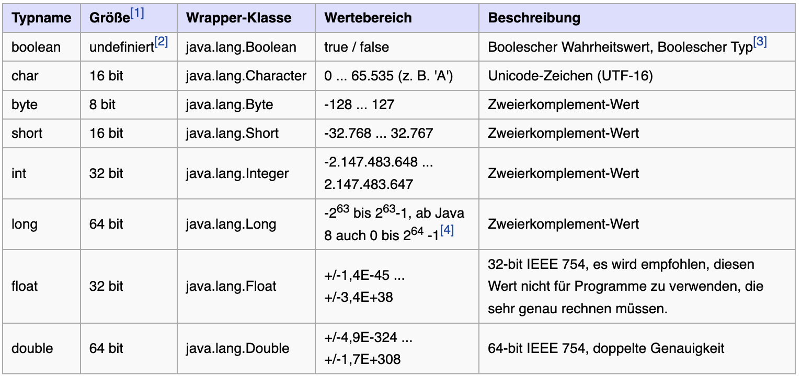
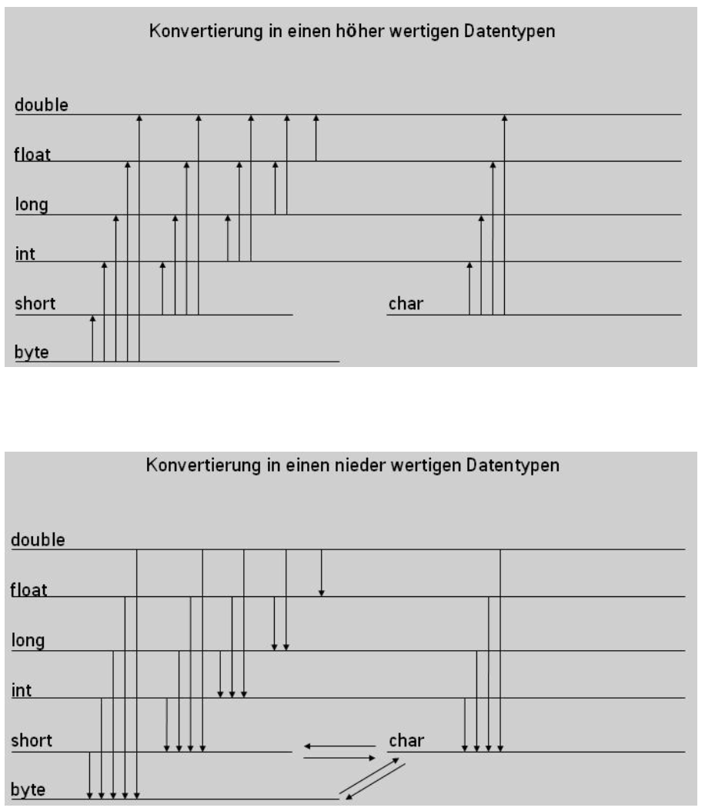

include::../../docs/settings.adoc[]
include::module-settings.adoc[]
:author: Thorsten Eckstein

// table of contents
:toc:

////
  Folgendes wird in "course-structure.adoc"
  aus jedem Modul zusammengeführt:

tag::content[]
----
1. Datentypen
2. Typumwandlungen
2.1. Implizite Typumwandlung
2.2. Explizite Typumwandlung (Casting)
3. Typumwandlung von komplexen Datentypen (Klassen)
----
end::content[]
////

== (Primitive) Datentypen

Übersicht über die Datentypen in Java:

Quelle: -> https://de.wikibooks.org/wiki/Java_Standard:_Primitive_Datentypen[Wikibooks: Datatypes]

Quelle: -> https://docs.oracle.com/javase/tutorial/java/nutsandbolts/datatypes.html[Oracle: Datatypes]

== Typumwandlungen

*Type-Casting* mit primitiven Datentypen

Man unterscheidet zwischen einer *expliziten* und einer *impliziten* Typumwandlung.

CAUTION: _Bei der Umwandlung in "kleinere" Datentypen können Fehler auftreten (Informationsverlust), es findet das sogenannte "Narrowing" automatisch statt. Es entsteht zwar kein Compiler-Fehler, aber z.B. die Zahl wird verfälscht (-> https://docs.oracle.com/javase/specs/jls/se17/html/jls-5.html#jls-5.1.3[Narrowing])_

=== Implizite Typumwandlung

Die implizite Typumwandlung findet automatisch bei der Zuweisung statt. Dies geht jedoch nur, wenn ein niederwertiger Datentyp in einen höher wertigeren Datentypen umgewandelt wird, also z.B. vom Datentyp `int` in den Datentyp `long`:

[, java]
----
int wert1 = 10;
long wert2 = 30;
wert2 = wert1; // automatische Umwandlung
----

=== Explizite Typumwandlung (Casting)

Die explizite Umwandlung erfolgt durch den sogenannten `cast`-Operator mit runden Klammern. Hier wird von einem höher wertigeren Datentyp in einen nieder wertigen Datentypen umgewandelt. In welchen Datentyp umgewandelt werden soll, muss bei dem cast Operator explizit angegeben werden.

[, java]
----
int wert1 = 10;
float wert2 = 30.5f;
wert1 = (int) wert2; // Umwandlung per 'cast'
----

== Typumwandlung von komplexen Datentypen (Klassen)

Auch *komplexe Datentypen* - also Instanzen von Java *Klassen* - können den Typen wechseln. Das ist natürlich ebenso klaren Regeln unterworfen.

So z.B. kann eine Klasse `Regionalzug` den Datentypen `Zug` bekommen, wenn die Klassen in einer Vererbungshierarchie stehen, ähnlich bei `Interfaces`. Das haben wir insb. schon im vorigen Modul `module-classes` gesehen und genutzt.

Das ist also insbesondere im Kontext der Vererbung interessant bzw. von Nutzen:

*Beispiel*:

[, java]
----
public abstract class HumanBeing {
 public String name;
}

public class German extends HumanBeing {
  public String country;
}

HumanBeing human = new German();
human.name = "Johnny Walker"; <1>

German german = (German)human; <2>
german.country = "Germany";
----

<1> Zugriff auf das Feld ´name´ der abstrakten Klasse `Human Being`
<2> Zugriff auf das Feld `country` der konkreten Klasse `German` erst NACH dem *Down-Casting* möglich.

*Demo/Beispiele*:

[subs=normal]
 -> {mod-ref-test}/demo/DatatypesDemoTest.java

'''

*Übungen*:

Übung 1 - Typumwandlung/Casting::

[subs=normal]
 -> {mod-ref-test}/exercise/DatatypesExerciseTest.java

Schreibe je einen Test für

a. Gegeben `char c = '1'` -> Umwandlung in `int`
b. Gegeben `int i = 127` -> Umwandlung in `byte`

und prüfe das Ergebnis, also den erwarteten Wert, jeweils mithilfe der Assertions-Methode `assertEquals(<expected>, <actual>)`.

