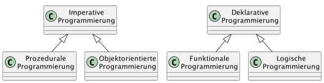

include::../../docs/settings.adoc[]
include::module-settings.adoc[]
:author: Thorsten Eckstein

// table of contents
:toc:

////
  Folgendes wird in "course-structure.adoc"
  aus jedem Modul zusammengeführt:

tag::content[]
----
1. Funktionale Programmierung in Java
1.1. Imperative Programmierung
1.2. Deklarative Programmierung
1.3. Lambda Ausdrücke
1.4. Streaming (API)
----
end::content[]
////

== Funktionale Programmierung in Java

Im Wesentlichen stehen sich 2 *Programmierparadigmen* gegenüber:

* das *imperative* Paradigma, aus dem sich OOP (objektorientierte Programmierung) entwickelte, und
* das *deklarative* Paradigma, das die Grundlage für die _funktionale Programmierung_ bildet.

In der Übersicht:

////
[plantuml, title="Paradigmen", png, align="center"]
....
include::diagrams/paradigms.puml[]
....
////

=== Imperative Programmierung

Bei einem *imperativen* Ansatz ist ein Programm eine _Abfolge von Schritten_, die ihren Zustand ändern, bis das Zielergebnis erreicht wird. Dieser Ansatz steht in engem Zusammenhang mit der Computerarchitektur (Neumann), bei der Anweisungen im Maschinencode einen globalen Zustand ändern. Der Maschinenzustand besteht aus Speicherinhalten und Prozessorregistern. Die meisten Computer verwenden dieses Modell.

Imperative *Programme* funktionieren ähnlich. Zuweisungsanweisungen werden verwendet, um im Speicher gespeicherte Daten zu manipulieren. Anweisungen werden in einer bestimmten Reihenfolge ausgeführt und verwenden diese Daten, um das gewünschte Ergebnis zu berechnen. Imperative Sprachen verwenden häufig Elemente wie Variablen, Schleifen und bedingte Anweisungen.

Zusammenfassend sind die wichtigsten Eigenschaften imperativer Programmierungen:

* veränderlicher Zustand
* Schritt-für-Schritt-Ausführung von Anweisungen und
* die Reihenfolge der Anweisungen ist wichtig

=== Deklarative Programmierung

Der *deklarative* Ansatz konzentriert sich auf die Endbedingungen eines gewünschten Ergebnisses und nicht auf die Abfolge von Schritten, die erforderlich sind, um dieses zu erreichen. Ein deklarativ geschriebenes *Programm* ist also keine Folge von Anweisungen, sondern eine Reihe von Eigenschaftsdeklarationen, die das resultierende Objekt haben sollte.

Die Charakteristiken von deklarativer Software sind:

* Das Endergebnis hängt nicht von einem externen Zustand ab
* Fehlen eines inneren Zustands zwischen den Ausführungen
* Determinismus – für die gleichen Eingabeargumente liefert das Programm immer das gleiche Ergebnis
* Die Ausführungsreihenfolge ist nicht immer wichtig – sie kann asynchron sein

Die *funktionale Programmierung* ist eine _Teilmenge_ der deklarativen Programmierung. Sie stellt ein _eigenständiges Programmierparadigma_ dar.

=== Lambda Ausdrücke

Bei der *funktionalen Programmierung* stehen also Funktionen im Mittelpunkt, sie werden nicht nur

* definiert und
* angewendet

sondern auch

* wie Daten miteinander verknüpft,
* als Parameter eingesetzt verwendet oder als
* Funktionsergebnisse genutzt.

Mit *Lambda Ausdrücken* wurde ein lang gefordertes Sprachkonstrukt in Java eingeführt, dass es in ähnlicher Form in anderen Programmiersprachen bereits gibt, z.B. in `C#`.

Der Einsatz von Lambdas erfordert zum Teil eine andere Denkweise und führt zu einem anderen Programmierstil, die wie oben gesagt dem Paradigma der _funktionalen Programmierung_ folgt.

Insbesondere in den Bereichen der Parallelverarbeitung von Daten sowie im Bereich der Frameworks finden sich viele Implementierungen, ebenso im Bereich des - bereits bekannten - *Collection* Frameworks.

Ein Lambda ist ein *Behälter für Sourcecode*, einer Methode sehr ähnlich, allerdings

* ohne _Namen_ und
* ohne expliziten _Rückgabewert_ und
* ohne Deklaration von _Exceptions_

Vereinfacht ausgedrückt kann man einen Lambda-Ausdruck am ehesten als eine _anonyme Methode und einer speziellen Syntax_/Kurzform bezeichnen

Seit `Java 8` sind also diese Elemente in der Sprache enthalten.

Die einfachste Form eines *Lambda* Ausdruckes ist:

 parameter -> expression

Um _mehr als einen Parameter_ zu nutzen, müssen runde Klammern angegeben werden:

 (parameter1, parameter2) -> expression

Weil die Ausdrücke limitiert sind und direkt einen Wert zurückgeben, kann auch ein Code-Block genutzt werden:

 (parameter1, parameter2) -> { code block }

Zu beachten ist, dass der `{ code block }` ein return statement enthalten muss.

Ein paar einfache Beispiele:

[, java]
----
(int x, int y) -> { return x + y; }
(long x) -> { return x + 2; }
() -> { String error = "invalid"; System.err.println(error); }
----

Die Zuweisung von Lambda-Ausdrücken zu Variablen geschieht auf folgende Weise. Dabei ist zu beachten, dass sich diese NICHT - wie alle anderen Klassen in Java - einer Referenz von `java.lang.Object` zuweisen lassen, das würde einen Compiler Fehler verursachen.

Stattdessen werden die Ausdrücke grundsätzlich sogenannten *Functional Interfaces* aus dem Paket

 java.util.function

zugewiesen. Diese sind eine Art von Typ und sind ein (normales) Interface, aber mit nur genau einer abstrakten Methode. Dies wird *SAM = Single Abstract Method Typ* genannt.

Konkrete Implementierungen dieser funktionalen Interfaces gibt es recht viele neue im Bereich der Lambdas, aber bereits vorher gab es solche auch schon, z.B. im Collections Framework mit dem Interface `Comparator<T>`.

[, java]
----
@FunctionalInterface
public interface BinaryOperator<T> {
    public abstract void apply(Object a, Object b);
}
----

Die *wichtigsten* funktionalen interfaces sind:

. `Consumer<T>` - beschreibt eine Aktion auf einem Element vom Type `T` mittels der Methode `void accept(T)`
. `Predicate<T>` - definiert eine Methode `boolean test(T)`. Sie berechnet für einen Eingabewert T ein bool'sches Ergebnis. Das lässt sich sehr gut für Filterbedingungen ausnutzen.
. `Function<T,R>` - Definiert eine Abbildungsmethode durch `R apply(T)`, wodurch Transformationen gut ausgedrückt werden können, gebräuchlich besonders für die Extraktion eines Attributes aus einem komplexen Typ
. `BiFunction<T,U,R>` und `BiConsumer<T,U>` - wie `Function`, nur mit zwei Eingabewerte `T` und `U`
. `Supplier<T>` - Stellt ein Ergebnis vom Typ `T` bereit. Im Gegensatz zu `Function<T,R>` erhält ein Supplier keinen Eingabewert mit der Methode `T get()`

Zu jedem dieser funktionalen Interfaces gibt es einen Unit-Test zur *Demonstration* hier:

[subs="normal"]
 {mod-ref-test}/funcprog/LambdaDemoTests.java

=== Streaming (API)

Das Streaming API stellt im Wesentlichen Methoden zur _schnellen, leicht lesbaren und bequemen_ Verarbeitung von Daten im Sinne einer *Mehrfach-* oder auch *Batch*-Verarbeitung bereit, und zwar in Form sogenannter *Streams*.

Insbesondere zur verbesserten Verarbeitung von _Listen_ aus dem Collections-Framework in Java wurden diese Komponenten mit Java 8 eingeführt

Aus diesem Grund wird auf einer _normalen_ Liste auch in aller Regel zuerst die Methode

 stream()

aufgerufen, die aus dem Objekttyp `Liste` einen `Stream` macht. Auf diesem _Stream_ lassen sich dann weitere Methoden zur Verarbeitung der Listenelemente aufrufen, und zwar mittels der sogenannten

 filter-map-reduce

Algorithmen genutzt, um diese Möglichkeiten zusammenzufassen.

Ein ausführliches Beispiel für den Gebrauch in *Listen*:

[source,java,title="Lamdba + Streaming"]
----
include::{mod-lnk-test}/funcprog/LambdaDemoTests.java[tag="lambda-example-1"]
----

Im Detail:

`*Filter*`

Filter werden durch die oben bereits genannten `Predicates` implementiert und in eine Methode namens `filter()` als _funktionales Argument_ übergeben.

-> _Welchen Datentyp geben die Predicates zurück?_

Bei der Anwendung mehrerer oder komplexer Filteroperationen sollte allerdings die Performanz beachtet werden. Eine Einschätzung:

.Performanz bei komplexen Filteroperationen
image::images/FilterPerformance.png[width="100%",align="center"]

`*Map*`

_"Mapping"_ Operationen auf Listen *transformieren* diese.

Sie werden häufig durch die oben bereits genannten `Functions` implementiert und in eine Methode namens `map()` als _funktionales Argument_ übergeben.

Methoden oder Klassen, deren Zweck die *Abbildung/Umwandlung von Klassen* in/auf andere Strukturen implementieren, werden dementsprechend sehr häufig auch _"mapping"_ Methoden genannt, daher hier dieser Term hier ebenfalls genutzt.

Besonders die Veränderung der Datentypen von *Listenelementen* ist ein wichtiger Anwendungsfall beim Einsatz von `map(...)`.

`*Reduce*`

`Stream.reduce()` Operation *reduzieren* die Ausgangsdatenmenge.

Dies erfolgt grundsätzlich in Teilschritten:

* `Identity` – Ein Element mit einem initialen Wert für die Reduktionsoperation und der "default return value" wenn der Stream leer sein sollte.
* `Accumulator` – Eine Funktion mit zwei Parametern: ein Teilergebnis der Reduktionsoperation und das nächste Element des Streams.
* `Combiner` – Eine Funktion um die Teilergebnisse (der Reduktionsoperation) zu kombinieren wenn `reduce` parallelisiert wird.

Richtig nutzbringend ist oft erst die Kombination `filter`, `map` und `reduce` Operationen, um aus einfachen *Daten* am Ende *Informationen* zu gewinnen.

Dazu ein Beispiel:

[source,java,title="Beispiel einer reduce() Operation"]
----
include::{mod-lnk-test}/funcprog/StreamingDemoTests.java[tag="reduce-example1"]
----

sowie als Beispiel für einen *fachlichen* Nutzen, der "Erkenntnisse" aus den fachlichen Daten ermittelt:

[source,java,title="Fachliches Beispiel (good code?, bad code?)", indent="0"]
----
include::{mod-lnk-test}/funcprog/LambdaDemoTests.java[tag="lambda-example-2"]
----

=== Demonstrationen

Die Unit-Tests zur *Demonstration* finden sich hier:

[subs="normal"]
 {mod-ref-test}/funcprog/LambdaDemoTests.java
 {mod-ref-test}/funcprog/StreamingDemoTests.java

=== Übungen

Nutzt folgendes Package für die *Unit-Tests*:

[subs="normal"]
 {mod-ref-test}/funcprog/FuncProgExerciseTests.java

Die im Test benutzten *Implementierungen* gehören in das Package:

[subs="normal"]
 {mod-ref-src}/funcprog/exercises/*.java

[[funcprog-exercise-1]]
*Übung 1:*

Implementiere eine Liste mit mehreren `boolean` Werten.

Nutze dann einen Lambda-Ausdruck, durch den die Listenelemente auf der Konsole ausgegeben werden können.

[[funcprog-exercise-2a]]
*Übung 2a:*

Implementiere den _"old fashioned way"_ für die Berechnung einer Summe:

[source, java, indent="0"]
----
include::{mod-lnk-test}/funcprog/FuncProgExerciseTests.java[tags="old-fashioned-reduce"]
----

[[funcprog-exercise-2b]]
*Übung 2b:*

Implementiere die Übung 2a mit modernen Mitteln, d.h. ersetze die "alte" `for-each` Loop durch einen *Lambda*-Ausdruck:

[source, java, indent="0"]
----
include::{mod-lnk-test}/funcprog/FuncProgExerciseTests.java[tags="modern-reduce"]
----

[[generics-exercise-3]]
*Übung 3:*

Für einen `Warenkorb` gilt es, die darin enthaltenen 3 `Produkte`nach ihrer `Produktkategorie` zu filtern.

_Optional: Ermittle den gesamten `Preis` des Warenkorbs als Summe der produkt-spezifischen Einzel-`Preise`._

Erstelle einen Unit-Test und (eine oder mehrere) Testmethoden für die Teilaufgaben.

=== Tipps, Patterns & Best Practices

*Predicates*

`Predicates` sollten, wenn möglich, _benannt_ werden, d.h. zum Beispiel anstelle von

 list.stream().filter(i -> i >= 10)

besser gekapselt in einer Methode oder mit einer Variable

 Predicate<Integer> isGreaterOrEqual10 = i -> i >= 10

oder

[source, java]
----
Predicate<Integer> isGreaterOrEqualTo(Integer number) {
   return i -> i >= number;
}
----

