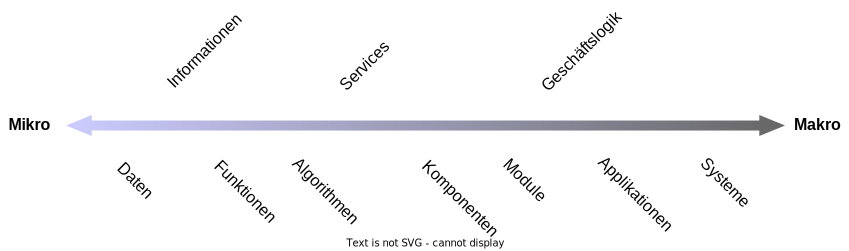
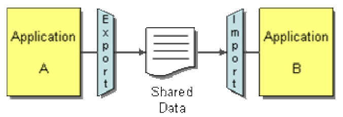
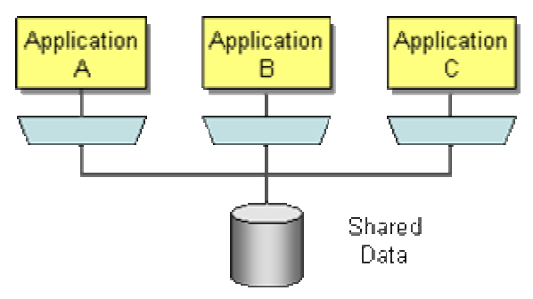
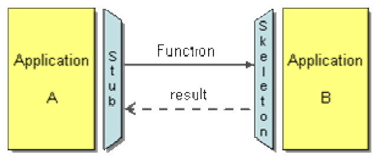
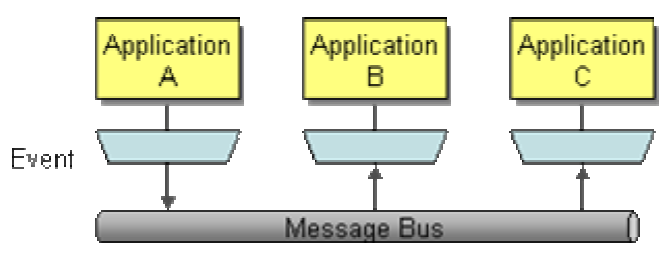
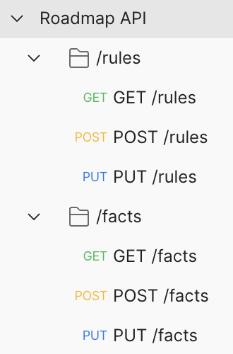

include::../../docs/settings.adoc[]
include::module-settings.adoc[]
:author: Thorsten Eckstein

// table of contents
:toc:

////
  Folgendes wird in "course-structure.adoc"
  aus jedem Modul zusammengeführt:

tag::content[]
----
1. Was versteht man unter "Integration"?
2. Integrationskriterien
3. Integrationsoptionen bzw. -muster
4. Synchrone Integration mit (REST)
5. Asynchrone Integration mit Nachrichten (Messaging)
----
end::content[]
////

== Was versteht man unter "Integration" ?

Ganz allgemein umfasst der Begriff *Integration* das Ziel, verschiedene Applikationen zusammen arbeiten zu lassen, um einen einheitlichen Satz an Funktionalität bereitzustellen. Hierbei werden viele Teilbereiche berührt, z.B.

* Integration auf verschiedenen *Ebenen* (Mikro- bis Makro)
* Integration mit unterschiedlichen *Technologien* (Frameworks, Protokolle)
* Unterschiedliche Integrations-*Zwecke* (Daten, Funktionen)
* Integration durch unterschiedliche *Stile* (Methoden, Architekturen)

*Was kann miteinander integriert werden?*

So gut wie alles, d.h. unter anderem ...

== Integrationskriterien

Um Daten, Funktionen, Services oder Anwendungen integrieren zu können, müssen viele Aspekte beachtet werden. Eine *gute Integration* muss entsprechend all die Erfordernisse, Komplexitäten Konsequenzen berücksichtigen. D.h., die Auswahl dessen, "was" und "wie" integriert wird, bedarf einer guten Entscheidungsgrundlage. Die folgenden *Kriterien* helfen bei diesen Überlegungen:

Standalone vs. Distributed::
Muss überhaupt integriert werden?

Lose vs. enge Kopplung (Grad der Integration)::
Wie viele Dinge/Aspekte und wie "eng" muss integriert werden? Wie unabhängig sind die integrierten Komponenten. Wie unabhängig sollen/müssen diese überhaupt sein? (Prinzip: _Loose Coupling_)

Simpel vs. Komplex (Einfachheit der Integration)::
Je komplexer eine Integration ist, desto schwieriger wird die Wartung und Weiterentwicklung sein. Das ist besonders dann relevant, wenn die integrierten Komponenten von unterschiedlichen Teams entwickelt werden. Also, je simpler, desto eher kann das "Zusammenwirken" der integrierten Teile evolvieren.
(Prinzip: _Minimum Impact_)

Technologie::
Welche Technologie soll/muss genutzt werden. Hier gibt es eine starke Abhängigkeit vom "Use Case" bzw. von den Erfordernissen der Fachlichkeit.

_Beispiel: Ein Überwachungssystem von Zügen muss Echtzeitdaten verarbeiten, d.h. alle Integrationsaspekte müssen diese Echtzeitverarbeitung ebenfalls unterstützen, wodurch die Auswahl der möglichen Technologien eingeschränkt wird._

Datenformat::
Integrierte Applikationen müssen sich in aller Regel über die ausgetauschten Daten einigen, entsprechend ist zu entscheiden, ob die übertragenen Daten einen "Vertrag" oder ein "Protokoll" erfüllen müssen oder ob es nur simple Daten ohne große Struktur handelt. Bestimmte Technologien adressieren diesen Punkt, z.B. _OpenAPI_, _Protobuf_ oder _Avro_.

Datenaktualität::
Wann und wie häufig (Frequenz) sollen integrierte System miteinander kommunizieren?

Daten vs. Funktionen::
Siehe Diagramm oben. Was muss integriert werden. Sind es nur (z.B. gemeinsam genutzte) Daten in einer Datenbank oder sollen ganze Services nutzbar sein?

Synchron vs. Asynchron::
Müssen Integrationsprozesse (Aufrufe) direkt beantwortet werden oder kann die Anfrage von der Antwort entkoppelt werden, sodass sie zeitlich nicht voneinander abhängig sind?

_Zwei bekannte Beispiele für ..._

* synchrone Kommunikation: `<<_restful_webservices>>`
* asynchrone Kommunikation: `<<_messaging>>`

== Integrationsoptionen bzw. -muster

. *File Transfer*. Wenn eine Anwendung Dateien für andere bereitstellen will, so können diese einfach ausgetauscht werden. Viele Im- und Export-Prozesse nutzen dieses Muster.

[start=2]
. *Shared Database*. Daten können - quasi im Hintergrund - einfach über eine gemeinsam genutzte Datenbank "ausgetauscht" werden. Hieraus ergeben sich natürlich weitere Fragestellungen, wie etwa die Einhaltung des ACID Prinzips (_Atomicity, Consistency, Isolation und Durability_).

[start=3]
. *Remote Procedure Invocation*. Wenn nicht Daten, sondern _"Verhalten"_ bereitgestellt werden, so können dieses von anderen Applikationen genutzt werden. Das Verhalten kann bspw. als Funktionen, Algorithmen, Logiken, Services oder ganze Geschäftsprozesse implementiert sein. Die Nutzung erfolgt dabei i.d.R. "remote", kann aber natürlich auch innerhalb einer Software auf diese Weise realisiert werden (z.B. über _"Service Meshes"_).

[start=4]
. *Messaging*. Verteilte, unabhängige Systeme kommunizieren über eine (zentrale, gemeinsame) Messaging Plattform. Hier können sowohl Daten als auch Funktionen Gegenstand der Kommunikation sein.

== Synchrone Integration mit (REST)

REST::
`Representational State Transfer` (REST) ist eine Software-Architektur, die Bedingungen zur Funktionsweise einer API festlegt. Häufig wird eine REST-basierte Architektur verwendet, um leistungsstarke zuverlässige Kommunikation nach Maß umzusetzen. Die Komponenten sind grundsätzlich leicht implementierbar und modifizierbar. Dadurch wird jedem API-System Sichtbarkeit und plattformübergreifende Portierbarkeit verliehen.

RESTful APIs::
APIs, die dem REST-Architekturstil folgen, werden als RESTful APIs bezeichnet. Webservices, die diese REST-Architektur implementieren, werden als *RESTful WebServices* bezeichnet.

Die wichtigsten *Charakteristiken* sind:

* Aufrufe und Antworten erfolgen über `HTTP(S)` (Request-Response-Cycle)
* Einheitliche Schnittstelle (konventionelle URLs)
* Bereitstellung von *Ressourcen* (nicht von Funktionen/Operationen)
* Die Standard *HTTP Operation* bilden die _Funktionalität_ ab (`GET, PUT, POST, DELETE, ...`)
* Zustandslosigkeit (Idempotenz)
* Cache-Fähigkeit
* Clients können die Form der Antwort steuern (`Media-Types`)

.Verwaltung von API Calls mit `Postman` (Integrationstests)

Die *Implementierung* einer API kann auf sehr verschiedene Arten erfolgen. Die nachfolgenden Beispiele entstammen einem echten Projekt, sind aber natürlich etwas gekürzt. Das Projekt nutzt vor allem `SpringBoot` und dessen Features/Module, die API bzw. Endpunkte in Form von Controller und mithilfe von Annotationen umzusetzen:

[source,java,lines,title="Beispiel für einen API Endpunkt, einen `Controller`"]
----
/**
 * Beispiel eines Aufrufes:
 * <pre>
 * GET http://localhost:8080/api/v1/systems/1234
 * </pre>
 */

@RestController
@RequestMapping("/api/v1/systems")
public class SystemDataController extends AbstractController {

    @Autowired
    private SystemService service;

    @GetMapping
    public ResponseEntity<List<SystemDataRepresentation>> findAll() {
        List<System> systems = service.findAll();
        if (systems == null || systems.isEmpty()) {
            return ResponseEntity.notFound().build();
        }
        List<SystemDataRepresentation> representations = toRepresentations(systems);
        return ResponseEntity.ok().body(representations);
    }

    @GetMapping(
            value = "/{id}",
            produces = APPLICATION_JSON_VALUE
    )
    public ResponseEntity<SystemDataRepresentation> find(@PathVariable("id") String id) {
        System system = service.findById(id);
        if (system == null) {
            return ResponseEntity.notFound().build();
        }
        SystemDataRepresentation representation = toRepresentation(system);
        return ResponseEntity.ok().body(representation);
    }

    /**
     * Creates a new system.
     */
    @PostMapping(consumes = APPLICATION_JSON_VALUE)
    @ResponseStatus(HttpStatus.CREATED)
    public String create(@RequestBody SystemDataRepresentation resource) {
        assertNotAlreadyPersistent(resource.getId());
        System system = toEntity(resource);
        return service.create(system).toString();
    }

    /**
     * Updates a system
     */
    @PutMapping(
            value = "/{id}",
            consumes = APPLICATION_JSON_VALUE
    )
    @ResponseStatus(HttpStatus.OK)
    public void update(@PathVariable("id") String id, @RequestBody SystemDataRepresentation resource) {
        assertAlreadyPersistent(id);
        System system = toEntity(resource);
        service.update(system);
    }

    @PatchMapping(
            value = "/{id}",
            consumes = APPLICATION_JSON_VALUE
    )
    @ResponseStatus(HttpStatus.OK)
    public void patch(@PathVariable("id") String id,
                      @RequestBody KeyValuePairRepresentation data) {
        assertAlreadyPersistent(id);
        System system = service.findById(id);
        service.patch(system, data.asMap());
    }

    /**
     * Deletes the system identified by the specified ID
     */
    @DeleteMapping(value = "/{id}")
    @ResponseStatus(HttpStatus.OK)
    public void delete(@PathVariable("id") String id) {
        service.deleteById(id);
    }

    private void assertAlreadyPersistent(String id) {
        if (id == null) {
            ExceptionContext error = ExceptionContextBuilder.error(
                    "Updating 'System' with name '%s' failed, "+
                    "because ID is missing!",id);
            throw new WebServiceException(error);
        }
    }

    private void assertNotAlreadyPersistent(String representationId) {
        System persistentSystem = service.findById(representationId);
        if (persistentSystem != null) {
            ExceptionContext error = ExceptionContextBuilder.error(
                    "Unable to create system, because a system with "+
                    "ID '%s' (and name '%s') already exists!",
                    persistentSystem.getId(),
                    persistentSystem.getName());
            throw new WebServiceException(error);
        }
    }
}
----

== Asynchrone Integration mit Nachrichten (Messaging)

Ein weiterer wichtiger Integrationsstil ist `Messaging`. Durch Messaging können Applikationen (sehr) lose durch `asynchronene` Kommunikation gekoppelt werden. Die kommunizierenden Systeme müssen dabei nicht gleichzeitig laufen, wodurch die Integration insgesamt zuverlässiger wird. Beim Messaging ist die `Messaging Middleware` verantwortlich für den Transport von Daten in Form von Nachrichten zwischen den Applikationen, nicht mehr die beteiligten Systeme selbst.

*Messaging Konzepte*

Channels::
Messaging Applikationen übertragen Daten in sogenannten `Message Channels`, virtuelle Pipelines, durch die Sender und Empfänger verbunden werden. Ein anwendungsspezifisches `Topic` ist ide Realisierung eines solchen Channels.

Messages::
Eine `Message` (Nachricht) ist ein atomares Paket, das über ein `Channel` transportiert werden kann. Anwendungsdaten, die übertragen werden sollen, müssen dementsprechend als Nachricht verpackt werden.

Multi-step Delivery::
Messages können, und werden häufig, im Kontext der `Messaging Middlware` in Form von Zwischenschritten verarbeitet, etwa transformiert oder validiert, bevor sie einem nutzenden System zur Verfügung gestellt werden. Die `Pipes and Filters` Architektur kommt hier zum Einsatz.

Routing::
Ein sogenannter `Message Router` als Teil der Middleware ist verantwortlich für die Verteilung von Nachrichten, anstatt dass die sendende Applikation "wissen" muss, wo die Nachricht konsumiert werden soll.

Transformation::
Daten werden in den unterschiedlichen Systemen in aller Regel sehr verschieden abgebildet (fachlich und technisch), da sie zu unterschiedlichen fachlichen Kontexten (_Domänen_) gehören. Das bedeutet, dass die in Form von Nachrichten übermittelten Daten sehr häufig _transformiert_ oder _übersetzt_ werden müssen (z.B. über `Adaptoren` bzw. `Translator`). Die Transformation kann (und sollte) geregelt laufen, und zwar über zentrale "Verträge" für die Datenformate. Zu diesem Zweck gibt es *Protokolle* und sogar *Compiler*, zu den bedeutenden gehören:

* `AVRO` (Dateien z.B. mit Endung `.asvc`)
* `Protobuf` (Dateien z.B. mit Endung `.proto`)

Endpoints::
Ein Layer oder eine Komponente in der eigenen Applikation, die die Kommunikation mit der _Messaging Middleware_ abstrahiert, sodass dessen API genutzt werden kann. Vielfach werden in den jeweils sogenannte `Message Producer` und `Message Consumer` Komponenten entwickelt, über die der Austausch von Nachrichten durchgeführt wird.

Eine Auswahl an bekannten Middleware *Produkten*:

* IBM Websphere MQ
* Apache Kafka (Confluent)
* RabbitMQ als AMQP-Broker
* SAP Process Integration
* Java EE Framework JMS
* Microsoft Message Queue

NOTE: Ein _Real-Life-Beispiel_ aus einem Projekt der Deutschen Bahn

image::diagrams/messaging-system-architecture-example.svg[width="100%", align="center"]

[source, java, lines, title="Kafka Producer"]
----
// uses several imports from Spring Framework, omitted here
@Service
public class Producer {

    @Autowired
    private KafkaTemplate<String,String> kafkaTemplate;

    public void sendMessage(String topic, String key, String message) {
        logger.trace("%n[simple] %s producing '%s' ", key, message);
        kafkaTemplate.send(topic, key, message);
    }

    // class Train generated by some kind of code generator according
    // to a schema (*.avro, *.protobuf)
    public void sendMessage(Message<Train> message) {
        logger.trace("%n[protocol] producing '%s' ", message);
        kafkaTemplate.send(message);
    }
}
----

[source, java, lines, title="Kafka Consumer"]
----
// uses several imports from Spring Framework, omitted here

@Service
public class Consumer {

    @Autowired
    private TrainAdapter trainAdapter;

    @Autowired
    private Producer producer;

    @KafkaListener(topics = "trains", groupId = "train-consumers")
    public void consumeMessage(
            ConsumerRecord<String, GenericData.Record> messageRecord) {

        // class Train generated by some kind of code generator according
        // to a schema (*.avro, *.protobuf)
        final Train train = trainAdapter.toTrain(messageRecord);

        logger.trace("%n message key = %s consuming '%s'",
           messageRecord.key(),
           messageRecord.value());

        final Train verifiedTrain = verify(train);

        // use/process instance of 'train' in this application, i.e.
        producer.publish(verifiedTrain);
    }

    // for example, in Producer: example of building a message
    private String publishVerifiedTrain(Train train) {

        Message<Train> message = MessageBuilder
                .withPayload(train)
                .setHeaderIfAbsent(
                        KafkaHeaders.TOPIC,
                        "verified-trains")
                .setHeader(
                        KafkaHeaders.MESSAGE_KEY,
                        "verified-train")
                .build();

        producer.sendMessage(message);

        return "... publishing finished successfully!";
    }

}
----

[source, json, title="Train AVRO Schema Example"]
----
{
    "type": "record",
    "name": "Train",
    "namespace": "de.db.rbltng.schema",
    "fields": [
        {
            "name": "trainNumber",
            "type": "string"
        },
        {
            "name": "type",
            "type": "string"
        }
    ]
}
----

[[pipes-and-filters-example]]

NOTE: Abschließend noch ein weiteres Beispiel für Messaging bzw. Anwendung der `Pipes & Filters Architektur`

.Pipes & Filters Beispiel
image::diagrams/pipes-and-filters-architecture-example.svg[width="100%", align="center"]

