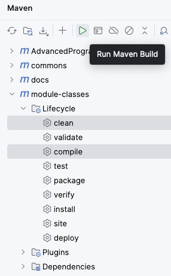
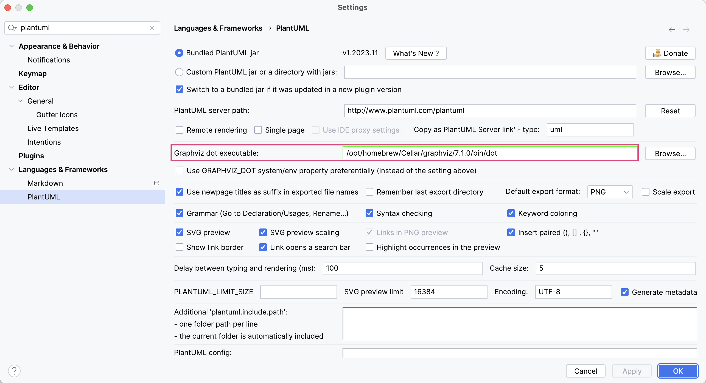

include::../../docs/settings.adoc[]
:author: Thorsten Eckstein

:toc:

== Welcome

*Über mich*

[cols="2h,8", grid="none"]
|===

| image:images/portrait.png[] | Thorsten Eckstein
| Unternehmen     | DB Systel GmbH, Frankfurt a.M., ca. 7.000 Mitarbeiter, interner IT-Dienstleister der Deutschen Bahn
| Qualifikationen | Dipl. Geo-Informatik, zertifizierter Softwareentwickler, zertifizierter Softwarearchitekt
| ...             | ...

|===

- Inhalt der LV
- Wer seid ihr und woher kommt ihr?
- Welche Erfahrungen mit Java sind vorhanden?
- Technische Voraussetzungen (IntelliJ, Java, Zugriff Internet)

== Fachlicher Schwerpunkt des Kurses (Zugdisposition)

=== Kontext

Der *Betrieb* von Zügen kann grundsätzlich unterteilt werden in:

. *infrastrukturelle* Sicht (_Stammdaten_)
. *planerische* Sicht (_Bewegungsdaten, SOLL_)
. *operative* Sicht (_Bewegungsdaten, IST_)

Ein paar wichtige Begriffe:

image::diagrams/business-model.svg["Fachbegriffe",width="75%",align="center"]

=== Klassenmodell

Eine solche Fachlichkeit (s.o.) muss, um Applikationen zu erstellen, in (Fach-) *Klassenmodellen* abgebildet werden, z.B. mit folgenden Objekten:

----
 + Zug (Zugarten), Wagon (Wagonarten)
 + Strecke, Abschnitt, Gleis
 + Ereignisse: Abfahrt, Ankunft
 + Fahrt
 + Fahrplan
 + Fahrgast
 + Dispositionsmaßnahme, Umleitung

 und viele weitere ...
----

Beispiel für ein grundsätzliches *Fachklassenmodell* mit zwei "Geschmacksrichtungen":

(1) *Infrastrukturelle* Sicht (statische Sicht):

[plantuml, "Klassenmodell-1", png, align="center"]
....
include::diagrams/business-model-ist.puml[]
....

(2) *Planerische* Sicht (dynamische Sicht):

[plantuml, "Klassenmodell-2", png, align="center"]
....
include::diagrams/business-model-soll.puml[]
....

== Quellcodeverwaltung mit `Git` und `Github`

Web: https://de.wikipedia.org/wiki/Git

*Git* ist ein verteiltes Versionsverwaltungssystem für Quellcode.

image:images/git-workflow.png[]

Das lokale Arbeitsverzeichnis wird `workspace` genannt. In diesem werden alle Quellcode-Dateien abgelegt, also z.B. ein Windows-Verzeichnis, in das der Quellcode heruntergeladen wird:

[Beispiel]
 d:/Projekte/dhbw/programmierung-mit-java

* Zuerst prüfen, ob `git` installiert ist. Das geht am besten im Kommandozeilen Tool durch

 git --version

* was zum Beispiel folgende Ausgabe ergibt: `git version 2.39.1`

* Zunächst muss das Repository "geklont",

https://github.com/ThorstenEckstein/programmierung2-W3WI-109-ss24

d.h. heruntergeladen werden, und so zu einer lokalen Kopie wird:

 git clone https://github.com/ThorstenEckstein/programmierung2-W3WI-109-ss24 -b hands-on

//Dann bitte direkt auf den Branch `hands-on` durch
// git checkout -b hands-on
// wechseln (kann man natürlich auch in der IDE/IntelliJ machen). In diesem Branch kann, sobald man ihn geklont hat, Code geschrieben werden, aber ...

* Zur Prüfung, auf welchem Branch man sich aktuell befindet, wechselt man in das neue, lokale Verzeichnis des Repositories und gibt ein:

 git branch

* Hier sollte jetzt etwas Ähnliches erscheinen:

   main
   develop
 * hands-on

CAUTION: ... es soll kein Code in das `remote` Repository *gepushed* werden, da es sonst zu Konflikten bei möglicherweise erforderlichen Updates (durch _pullen_) kommen kann!

._Hilfe zu bzw. Anzeige von Umgebungsvariablen_
[%collapsible]
====
- *PowerShell*: Umgebungsvariablen prüfen, um alle anzuzeigen

 gci env:

- oder um nur eine einzelne - hier der PATH - anzuzeigen:

 $env:PATH

- *CMD (Command Line Tool)*: Umgebungsvariablen prüfen, um alle anzuzeigen

 set

- oder um nur eine einzelne - hier der PATH - anzuzeigen:

 echo %Path%
====

== IDE Setup

==== Einrichtung eines lokalen _Workspaces_

TIP: Zuerst wird ein lokaler _Workspace_ eingerichtet, d.h. ein Wurzelverzeichnis, in das das SourceCode-Repository bzw. die Kursinhalte "geklont/gespeichert" werden kann.

_(Natürlich kann man hier immer den persönlichen Präferenzen für dieses Wurzelverzeichnis folgen, für die Einrichtung des Kurses ist es aber besser, den Empfehlungen zu folgen ...)_

Man kann alles Folgende auf unterschiedliche Arten erledigen, vor allem mit dem Unterschied

* Über die GUIs bzw. Menüs der Tools, z.B. bei `IntelliJ` oder
* Über die Kommandozeilen Tools, z.B. `CMD`, `PowerShell` oder die `bash`

_(Ich persönlich richte meine lokale Arbeitsumgebung (den Workspace) wann immer möglich, etwa für ein Projekt, mit exakt der gleichen Struktur wie die des (Online/Remote-) Repositories ein, dazu später mehr)_

Wir verfolgen hier für bestimmte Schritte des Setups die Kommandozeilen Tools, insbesondere für die initiale Nutzung von `git`. Zunächst aber der Workspace:

.Einrichtung Workspace unter *Windows* (11) am Beispiel
[%collapsible]
====
- Terminal (oder auch `CMD` - "Command Line Prompt", könnte PowerShell sein) öffnen (z.B. mit "Suche" nach dem Begriff "Terminal")

- Den aktuellen Pfad im Terminal prüfen

 dir
 => C:\Users\<your-name>

- Hier einen "Workspace" anlegen, d.h. ein Wurzelverzeichnis z.B. "Projekte":

 mkdir Projekte

- Also im Ergebnis:

 C:\Users\<your-name>\Projekte
====

.Einrichtung Workspace unter *MacOS* am Beispiel
[%collapsible]
====
- Terminal öffnen
- Den aktuellen Pfad im Terminal prüfen

 pwd
 => /Users/<your-name>

- Hier einen "Workspace" anlegen, d.h. ein Wurzelverzeichnis z.B. "Projekte":

 mkdir Projekte

- Also im Ergebnis:

 /Users/<your-name>/Projekte
====

=== `Java`

*Empfehlung*: Im Kurs soll folgende Java Version verwendet werden:

 Java 19

Ggf. muss diese Version noch installiert werden, wobei die Versionsnummern ("Minor") _hinter_ der Hauptversionsnummer 19 ("Major") nicht so wichtig sind.

- In den neuen Workspace, momentan noch leeren Ordner (s.o.), wechseln

 cd Projekte

- Hier ein Terminal/Kommando-Shell öffnen

- Prüfen, ob `java` vorhanden ist, einfach durch Eingabe von

 java -version

Dann sollte eine Java Version angezeigt werden.

=== IDE `IntelliJ`

*IDE*. Die empfohlene IDE ist `IntelliJ`. Die Seminarinhalte sollten sowohl in der _Community_ als auch in der _Enterprise_ Edition funktionieren.

Der Code für den Kurs wurde mit folgender Version erstellt, die installiert sein muss (falls noch nicht vorhanden, bitte installieren):

 Versionen > IntelliJ IDEA 2023.2 (Community Edition)

TIP: [small]#Alternativ kann auch `MS Visual Studio Code` genutzt werden und diese Umgebung sollte auch bei der Einrichtung keine besonderen Probleme verursachen. Aber ... auf eigene Gefahr ;-), die Lehrveranstaltung wurde für IntelliJ vorbereitet!#

IntelliJ bietet ein neben dem Standard-Layout auch ein experimentelles, das aktiviert werden kann. Der Standard ist aber vollkommen ok.

[big]#IntelliJ *PlugIns*#

*Bundled PlugIns*::
Mit IntelliJ werden diverse PlugIns automatisch installiert, dazu gehören die folgenden, die für das Seminar erforderlich sind und anfangs mal geprüft werden sollen:

[cols="5a,5e", grid="none", frame="none"]
|===
| PlugIn | Kommentar

| Git & GitHub
| Source Code Management, lokaler Git-Client sollte mind. die Version 2.39.1 haben.

| image::images/maven-plugin.png[]
| Build- & Dependency Management
|===

*Non-bundled PlugIns*::
Für den Code und Tests und die Dokumentation sind folgende PlugIns erforderlich, die nicht sowieso mit IntelliJ installiert werden:

[cols="3a,4e,3m", grid="none", frame="none"]
|===
| PlugIn | Was ist das? | Version

| image::images/asciidoc-plugin.png[]
| Einheitliche Erstellung von Dokumentationen
| > 0.40.x

| image::images/diagrams-net-plugin.png[]
| Erstellung von beliebigen Diagrammtypen
| > 0.2.4

| image::images/plantuml-plugin.png[]
| Erstellung von UML-Diagrammen
| > 7.3.0-IJ2023.2

| image::images/database-plugin.png[width="70%"]
| Zugriff auf H2 Datenbank
| > 3.4.2299.0

|===
[small]#_PS: Ich persönlich aktualisiere recht zeitnah alle PlugIns._#

== Projektverwaltung mit `Maven` & Projektstruktur

Das Projekt bzw. jedes `Modul` dieser Lehrveranstaltung hat eine ähnliche Struktur, die die Nutzung vereinfacht und die *Wiedererkennbarkeit* verbessert:

Im *Allgemeinen*:

[subs=normal]
----
{icon-dir} <Projekt-Wurzel>
  {icon-dir} <Modul-Wurzel>
    {icon-dir} docs        -> Dokumentation zum Modul
    {icon-dir} src         -> Wurzel für den gesamten Sourcecode
      {icon-dir-src} main      -> Wurzel für den "produktiven" Sourcecode
        {icon-dir-src} java ...
      {icon-dir-test} test      -> Wurzel für den Test-Sourcecode
        {icon-dir-src} java ...
    {icon-dir} target      -> Kompilierte Klassen
----

Am *Beispiel* des ersten Moduls `module-classes`:

[subs=normal]
----
{icon-dir} <Repository-Wurzel-Verzeichnis>
  {icon-dir} module-classes
    {icon-dir} docs
    {icon-dir} src
      {icon-dir-src} main
        {icon-dir-src} java              -> ab hier "Package" Verzeichnisse
          {icon-dir-src} de
            {icon-dir-src} dhbw
              {icon-dir-src} demo        -> Klassen zur Demonstration,
                               ggf. mit Unterverzeichnissen
              {icon-dir-src} exercise    -> Klassen, die im Rahmen von Tests
                               implementiert werden
              {icon-dir-src} solution    -> Klassen, die Lösungen für die Tests sind
      {icon-dir-test} test
    {icon-dir} target
----

Ein sehr weit verbreitetes Framework bzw. Tool zur Erzeugung solcher Projektstrukturen ist das bekannte `Maven` (Alternative `Gradle`).

Die Erstellung einer Software beinhaltet viele Voraussetzungen, aber noch vor Beginn der Implementierung sollte man sich über ein paar Grundlagen Gedanken machen.

Dazu gehört das *Build- & Dependency Management*. Aus diesem Grund wird Maven auch als *Dependency Management Tool* bezeichnet.

-> https://maven.apache.org

Es erleichtert an dieser Stelle u.a. ...

- die Verwaltung von _Dependencies_,
- die Verwaltung des _Classpath_,
- den _Compile_ des Projektes,
- die _Konfiguration_,
- den _Build_ des Projektes und nicht zuletzt
- das _Deployment_ des Liefergegenstandes (Deliverable)
- es ermöglicht Erweiterungen durch PlugIns
- ... und viele weitere Aspekte

Das Tool verfolgt das Konzept

 Convention over Configuration

das eine geringst mögliche *Grundkonfiguration* ermöglicht, weil das Tool einfach eine Reihe von Annahmen trifft, die für sehr viele Projekte allgemein anerkannt sind und häufig genutzt werden. Erst wenn von diesen _Konventionen_ abgewichen werden muss, kann das Projekt entsprechend _konfiguriert_ werden.

Die wichtigste Datei für Maven ist das *`Project Object Model`* in Form der Datei

 pom.xml

die sowohl im Gesamtprojekt als auch im Wurzelverzeichnis jeden Moduls zu finden ist (sh. nachfolgend "parent-child-Beziehung"). Diese werden von vielen *IDEs* automatisch erkannt und beim Laden des Projektes für die Projektkonfiguration genutzt.

Bei hierarchischen Projektstrukturen wie in diesem Kurs gibt es mehrere POMs innerhalb der Hierarchie, sogenannte _parent_ und _child_ POMs, die zusammen gehören (-> vgl. Repository zu dieser LV).

*Nutzung von Maven*

Das Projekt sollte jetzt einmal insgesamt "gebaut" werden:

* entweder über das User-Interface von `IntelliJ`
* oder über die Kommandozeile

Am besten einfach in IntelliJ:

* Rechts oben am Rand von IntelliJ gibt es ein Symbol `_m_` (=maven), das öffnet die Standard Maven-View -> *(1)*

* Dann gibt es ein Symbol zur Ausführung von Maven -> *(2)*
* darauf hin öffnet sich ein modales Fenster, hier gibt man

 mvn clean compile

in der Kommandozeile ein oder macht das über die *GUI* -> *(3a)* oder *(3b)*

[cols="1a,1a,1a",grid="none",frame="none"]
|===
^| (1) ^| (2) ^| (3a)
| image::images/maven-view.png[]
| image::images/execute-maven-goal.png[]
| image::images/mvn-clean-compile.png[]
oder *(3b)*

|===

Das Projekt sollte jetzt "bauen", d.h. die Sourcen _kompilieren_ und _assembeln_ (`/target` Ordner, spiel hier aber keine Rolle). Im unteren Bereich von IntelliJ öffnet sich automatisch eine Console und das "Build" Ergebnis wird angezeigt ... hoffentlich [green]#*SUCCESS*# für alle Module ;-) ...

== Tipps, Tricks, Probleme & Lösungen

=== Die Anzeige von Diagrammen in AsciiDoc Dokumenten schlägt fehl

Fehlermeldung im Diagram signalisiert, dass das Tool `graphviz` fehlt.

Dieses Tool muss ...

 . zuerst installiert werden -> https://graphviz.org/download/[https://graphviz.org/download/] und dann
 . in IntelliJ für das PlugIn AsciiDoc bekannt gemacht werden, durch Angabe des Pfades zur `dot` Ausführungsdatei (z.B. `dot.exe`)

IMPORTANT: Die Pfade im obigen Bild sind MacOS Pfade, unter `Windows` sehen diese etwas anders aus!
