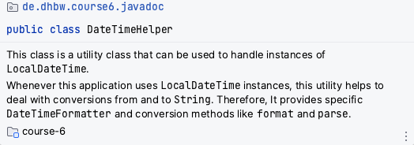
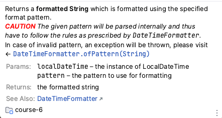

include::../../docs/settings.adoc[]
include::module-settings.adoc[]
:author: Thorsten Eckstein

// table of contents
:toc:

////
  Folgendes wird in "course-structure.adoc"
  aus jedem Modul zusammengeführt:

tag::content[]
----
1. Javadoc
1.2. Theorie & Einführung
1.3. Erzeugen von Javadoc
----
end::content[]
////

== Javadoc

=== Preparation

include::../../docs/includes/update-project.adoc[]

=== Theorie & Einführung

Quellcode sollte gut dokumentiert werden, allerdings gibt es sehr unterschiedliche Ansichten zu dem Thema.

Zunächst kurz die Grundlagen.

Es gibt *3 Arten* von Kommentaren:

. `// ...` "Single-Line" Kommentare
. `/* ... */` "Multi-Line" Kommentare
. `/** ... */` Dokumentationskommentare für `Javadoc`

Für die dritte Variante gibt es Syntaxregeln zu beachten, weil aus diesen Kommentaren Websites erstellt werden können, die die "offizielle" Dokumentation des Sourcecodes bzw. der API darstellen und insofern allgemein anerkannten Regeln folgen sollten.

Ein paar grundlegende Richtlinien bzgl. der *Javadoc* Dokumentation:

. Die öffentliche API *muss* dokumentiert werden, sie dient als eine Art Vertrag für den Aufrufer/Nutzer
. Darüber hinaus *sollten* alle Codeteile dokumentiert werden, die für das Verständnis des Codes von besonderer Bedeutung sind
. Private Felder oder Methoden werden *in der Regel nicht* dokumentiert (_es sei denn sie dienen Punkt 2._)
. In Javadoc *sollte* vorrangig die (_fachliche_) Bedeutung der Implementierung dokumentiert werden, weniger die (_technische_) Art und Weise bzw, Umsetzung
. Javadoc sollte mithilfe des Command Line Tools `javadoc` erzeugt werden

Und ein wenig *Best Practices* zu Umsetzung bzw. Syntax:

* Nutze HTML tags zur Formatierung der Dokumentation, z.B. `
, <pre>, <ol>, <strong>` und weitere
* Nutze `<code>` für Schlüsselwörter und Namen oder Bezeichnungen
* Nutze "in-line" Verknüpfungen, aber sparsam, und für Verweise auf die API den `{@link}` Tag
* Klammern können zur Dokumentation der allgemeinen Form von Methoden und Konstruktoren weggelassen werden
* Nutze die 3. Person in der Doku
* Methoden Beschreibungen beginnen (i.d.R.) mit einem Verb
* Klassen/Interface/Feld Beschreibungen lassen das Subjekt weg, und drücken lediglich den Zustand des Objektes aus
* Nutze `this` anstelle von "das/die", wenn sich die Doku auf die Instanz der Klasse bezieht

Ein paar Beispiele:

*Javadoc einer Klasse:*

[source, java, indent=0]
include::{mod-lnk-src}/javadoc/demo/DateTimeHelper.java[tags=javadoc-class]

In HTML umgewandelt:

*Javadoc eines Feldes:*

[source, java, indent=0]
include::{mod-lnk-src}/javadoc/demo/DateTimeHelper.java[tags=javadoc-field]

*Javadoc einer Methode:*

[source, java, indent=0]
include::{mod-lnk-src}/javadoc/demo/DateTimeHelper.java[tags=javadoc-method]

In HTML umgewandelt:

=== Erzeugen von Javadoc

Die Erzeugung erfolgt mit dem Java Tool

 javadoc

am besten aus der Kommandozeile heraus, es geht aber aus der IDE heraus. Üblicherweise ist die Javadoc Generierung Teil des `build` Prozesses, also gleich mit der Kompilierung und dem Packaging, so daß die Code-Dokumentation gleich eingebetteter Teil des Liefergegenstandes (_Deliverable, Artifact_) wird.

In den Verzeichnissen von Kurs 6 gibt es einem Ordner `/html`, in dem die erzeugte Dokumentation abgelegt ist, aber nur für einen Teil von Sourcecode.

Dazu sind folgende kurze Steps erforderlich:

. *Aufrufen* eines Terminals

da die folgenden Befehle in der Kommandozeile ausgeführt werden sollen

[start=2]
. *Wechseln* in das Wurzelverzeichnis des Sourcecodes vom Modul _module-javadoc_:

 cd <your-repo-path>/module-javadoc/src/main/java

. *Erzeugen* der Javadoc Dokumentation für ein spezifisches Java Package:

 javadoc -d ../../../html de.dhbw.javadoc.demo

NOTE: [small]#_Falls die Java Laufzeitumgebung im Terminal nicht bekannt ist, muss diese entsprechend aktiviert werden. Zum Testen der Verfügbarkeit nutzt man z.B. einfach den Befehl `java -version`._#

////
a) source ~/.bash_profile
b) java17
c) java -version
////

=== Demonstrationen

Die Unit-Tests zur *Demonstration* finden sich hier:

[subs="normal"]
 {mod-ref-test}/javadoc/JavadocTests.java

=== Exercises

Nutze folgendes Package für deine *Unit-Tests*:

[subs="normal"]
 {mod-ref-test}/javadoc/ExerciseTests.java

Die im Test benutzten *Implementierungen* gehören in das Package:

[subs="normal"]
 {mod-ref-src}/javadoc/exercises/*.java

[[javadoc-exercise-1]]
*Übung 1:*

[[javadoc-exercise-2]]
*Übung 2:*

=== Tipps, Patterns & Best Practices

