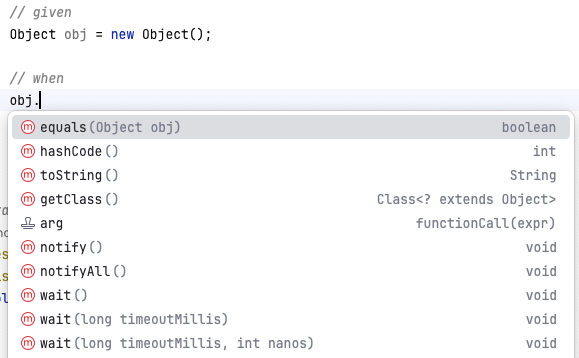
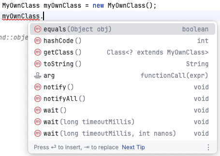

include::../../docs/settings.adoc[]
include::module-settings.adoc[]
:author: Thorsten Eckstein

// table of contents
:toc:

////
  Folgendes wird in "course-structure.adoc"
  aus jedem Modul zusammengeführt:

tag::content[]
----
1. Der Objektvertrag
1.1. Objektidentität mit hashCode()
1.2. Objektgleichheit mit equals()
1.3. Objektrepräsentation mit toString()
----
end::content[]
////

[[object-contract]]
== Der Objektvertrag

In Java *erben* alle Klassen automatisch von der Klasse

 java.lang.Object

denn _alle Klassen_ in Java _sind_ "Objekte", daher wird Java selbst auch als

[subs=normal]
 *objektorientierte* Programmiersprache

bezeichnet. Die Definition dieser obersten Klasse ist natürlich dokumentiert:
-> https://docs.oracle.com/en/java/javase/17/docs/api/java.base/java/lang/Object.html[https://docs.oracle.com/.../java/lang/Object.html]

Jedes Objekt in Java hat eine *grundlegende Menge an Funktionalitäten*, wie im Bild dargestellt:

Alle Klassen in Java *erben* von der Klasse `Object`:

[, java]
----
public class MyOwnClass extends Object {}
----

Da dies zu 100% für _alles_ und _immer_ gilt, muss es nicht explizit hingeschrieben werden, sodass folgendes z.B. beim Implementieren einer neuen Klasse vollkommen ausreicht:

[, java]
----
public class MyOwnClass {} // ohne 'extends'
----

Obwohl weder direkt sichtbar noch explizit implementiert, sind die *Methoden*, die von `Object` bereitgestellt werden, durch die *Vererbung* dennoch nutzbar:

Die Klasse stellt also eine Art *Grundvertrag* (_Object Contract_) für alle Java Klassen dar und bietet eine grundlegende Menge an Funktionalitäten für alle Java Klassen.

Von diesen *Methoden* sollen die folgenden drei etwas näher betrachtet werden, da sie eine besondere Bedeutung haben:

* `equals()`
* `hashCode()`
* `toString()`

Die `Object`-Klasse definiert - neben anderen - diese Methoden. Sie werden im Folgenden detailliert erläutert.
Die `toString()` Methode ist vor allem deshalb interessant, wie sie die Möglichkeit bietet, eine String-Repräsentation des jeweiligen Objektes zu implementieren (dazu später mehr).

=== Objektidentität mit `hashCode()`

Instanzen von Klassen - also Objekte - besitzen eine implizite *Identität*, eine Zahl.

_Was bedeutet diese *Objektidentität*?_

Einfach ausgedrückt, gibt `hashCode()` einen *ganzzahligen Wert* zurück, der von einem _Hashing-Algorithmus_ generiert wird. Anhand dieser Zahl wird standardmäßig entscheiden, ob Instanzen _identisch_ sind oder nicht.

Beim Vergleich von Objekten/Instanzen ist aber die _Gleichheit_ von der _Identität_ zu unterscheiden!

Etwas "ungenau" formuliert kann man sagen:

. *Identität* zweier Instanzen bedeutet i.d.R. _technisch_/_referenziell_ gleich
. *Gleichheit* zweier Instanzen bedeutet i.d.R. _fachlich_ gleich

Der allgemeine *Vertrag* von `hashCode()` besagt:

* Immer wenn `hashCode()` während der Ausführung einer Java-Anwendung mehr als einmal für dasselbe Objekt aufgerufen wird, muss es konsistent *denselben* Wert zurückgeben. Vorausgesetzt, dass keine Informationen geändert werden, die in Gleichheitsvergleichen für das Objekt verwendet werden. Dieser Wert muss nicht von einer Ausführung einer Anwendung zur anderen Ausführung derselben Anwendung konsistent bleiben.
* Wenn zwei Objekte gemäß der Methode `equals(Object)` *gleich* sind, muss der Aufruf der Methode `hashCode()` für jedes der beiden Objekte denselben Wert erzeugen.
* Wenn zwei Objekte gemäß der Methode `equals(Object)` *ungleich* sind, muss der Aufruf der Methode `hashCode()` für jedes der beiden Objekte nicht zwingend zu unterschiedlichen ganzzahligen Ergebnissen führen. Man sollte sich jedoch darüber im Klaren sein, dass die Leistung von Hash-Tabellen durch die Erzeugung unterschiedlicher ganzzahliger Ergebnisse für ungleiche Objekte verbessert wird.
* „Soweit es einigermaßen praktikabel ist, gibt die von der Klasse `Object` definierte Methode `hashCode()` eindeutige Ganzzahlen für verschiedene Objekte zurück.“

Viele _interne_ Methoden und/oder Prozesse, die von der Java API angeboten werden, nutzen im Hintergrund die hier diskutierten Prinzipien, z.B. bei `HashMaps`, bei der der Begriff `hash` schon im Namen verankert ist.

=== Objektgleichheit mit `equals()`

Die Standardimplementierung von `equals()`, d.h. wenn sie "nur" von Object geerbt wird und _nicht_ in der (neuen) Klasse implementiert wird, besagt, dass *Objekt-Gleichheit* dasselbe ist wie *Objekt-Identität*.

Das lässt sich besser am Code erläutern:

[source, java, linenums, title="Gleich oder Identisch?", indent=0]
----
include::{mod-lnk-test}/demo/ObjectContractDemoTest.java[tag="object-contract-1"]
----

[source, java, linenums, title="Gleich oder Identisch?", indent=0]
----
include::{mod-lnk-test}/demo/ObjectContractDemoTest.java[tag="object-contract-2"]
----

=== Objektrepräsentation mit `toString()`

Die Standardimplementierung von `toString` ist eine Kombination von *Klassenname* und *HashCode* (Identität):

[,java]
----
getClass().getName() + "@" + Integer.toHexString(hashCode());
----

Die Zahl rechts vom `@` Symbol ist der HashCode, nur konvertiert in einen vorzeichenlosen, ganzzahligen (Integer-) Wert im _Hexadezimalformat_ (Basis 16).

Als *Beispiel*, der Aufruf von

[,java]
----
Object obj = new Object();
String str = obj.toString();
----

ergibt eine Zeichenkette `str` ähnlich dem Folgenden:

 java.lang.Object@76b10754

'''

*Übungen*:

[subs=normal]
 -> {mod-ref-test}/exercise/ObjectContractExerciseTest.java

NOTE: [small]#Für beide Übungen gilt: Der Code soll, soweit möglich, durch Generierung erzeugt werden, z.B.: _new class, generate constructor, generate getter and setter_#

*Übung 1*:

. Erzeuge eine Klasse `Geldschein` mit einem Feld `betrag` (_double_) ab
. Erzeuge auch einen Konstruktor für dieses Feld
. Erzeuge im einem Test zwei Instanzen mit demselben Geldbetrag
. Teste, ob die Geldschein-Instanzen mittels `equals()` gleich sind

*Übung 2*:

. Nutze die Klasse `Geldschein` von _Übung 1_ nochmal
. Erzeuge in dieser Klasse nun die Objektvertrags-Methoden `equals()` und `hashCode()` und nutze für deren Implementierung das Feld `betrag`
. Erzeuge im nachstehenden Test zwei Instanzen, wieder mit demselben Betrag
. Teste, ob die Geldschein-Instanzen gleich sind

