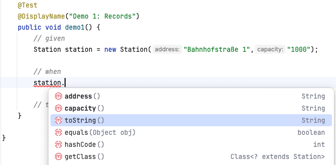

include::../../docs/settings.adoc[]
include::module-settings.adoc[]
:author: Thorsten Eckstein

// table of contents
:toc:

////
  Folgendes wird in "course-structure.adoc"
  aus jedem Modul zusammengeführt:

tag::content[]
----
1. Java Records
1.1. Ziel/Zweck
1.2. Basics
----
end::content[]
////

== Java Records

Die Übergabe *unveränderlicher Daten* (Konzept "Immutability") zwischen Objekten ist eine der häufigsten, aber "einfachsten" Aufgaben in vielen Java-Anwendungen.

Vor Java `14` erforderte dies die Erstellung einer Klasse mit Standardfeldern (die sogenannten `getter` und `setter` Methoden) und -methoden, die anfällig für triviale Fehler und unklare Absichten waren.

Mit Java 14 können diese _Probleme_ nun mithilfe von

 records

behoben werden.

=== Ziel/Zweck

Im Allgemeinen werden Klassen implementiert, um Daten in Feldern zu speichern, z.B. Datenbankergebnisse, Abfrageergebnisse oder Informationen zu Objekten oder von einem Dienst. In vielen Fällen sind diese Daten unveränderlich, da die Unveränderlichkeit die Gültigkeit der Daten ohne Synchronisierung gewährleistet (insb. wenn Daten zwischen Server und Client ausgetauscht werden).

Um dies besser zu erreichen, können *Datenklassen* mit folgenden Eigenschaften erstellt werden:

* `privates`, `finales` Feld für jedes Datenelement
* `Getter` für jedes Feld
* `public` Konstruktor mit einem entsprechenden Argument für jedes Feld
* `equals` Methode, die für Objekte derselben Klasse „true“ zurückgibt, wenn alle Felder übereinstimmen
* `hashCode` Methode, die denselben Wert zurückgibt, wenn alle Felder übereinstimmen
* `toString` Methode, die den Namen der Klasse und den Namen jedes Felds sowie den entsprechenden Wert enthält

Beispielsweise folgende einfache Klasse `Station` (Bahnhof) mit Name und Adresse:

[,java]
----
public class Station {

    private final String address;
    private final String capacity;

    public Station(String address, String capacity) {
        this.address = address;
        this.capacity = capacity;
    }

    @Override
    public String toString() {
        return "Station{" +
                "address='" + address + '\'' +
                ", capacity='" + capacity + '\'' +
                '}';
    }

    @Override
    public boolean equals(Object o) {
        if (this == o) return true;
        if (o == null || getClass() != o.getClass()) return false;
        Station station = (Station) o;
        return Objects.equals(address, station.address) &&
               Objects.equals(capacity, station.capacity);
    }

    @Override
    public int hashCode() {
        return Objects.hash(address, capacity);
    }

    // standard getters
}
----

Obwohl das *Ziel* erreicht wird, gibt es zwei Probleme:

. Es gibt eine Menge _Boilerplate-Code_
. Der Zweck der Klasse wird verschleiert, nämlich ein Bahnhof mit Adresse und Kapazität darzustellen

Zu 1. In dem Fall muss der gleiche Erstellungsprozess für jede Datenklasse wiederholt werden und ein neues Feld für jedes Datenelement erstellt werde, zudem _equals()_, _hashCode()_ und _toString()_. Außerdem ein Konstruktor, der jedes Feld akzeptiert.

Während IDEs viele dieser Klassen *automatisch generieren* können, können sie unsere Klassen nicht *automatisch aktualisieren*, wenn ein neues Feld hinzufügt werden muss. Wenn beispielsweise ein neues Feld hinzufügt wird, muss die Methode _equals()_ ebenfalls aktualisiert werden, um das neue Feld einzubinden.

Zu 2: Der zusätzliche Code verschleiert, dass die Klasse lediglich eine Datenklasse sein soll, die über zwei String-Felder verfügt: Adresse und Kapazität.

=== Basics

Ab JDK 14 können solche sich wiederholenden Datenklassen `records` ersetzt werden. `Records` sind unveränderliche Datenklassen, die nur den Typ und Namen von Feldern erfordern.

Die Methoden `equals`, `hashCode` und `toString` sowie die privaten, `final` Felder und der `public` Konstruktor werden vom Java-Compiler *generiert*.

Um eine `Station` zu erstellen, wird das Schlüsselwort `record` verwendet:

[,java]
----
public record Station (String address, String capacity) {}
----

Außerdem werden public *Getter*-Methoden generiert, deren Namen mit dem Namen der jeweiligen Felder übereinstimmen.

Für das `record Station` bedeutet dies:

.Automatisch generierte Getter-Methoden

Darüber hinaus lässt sich die `record` Klasse in vielfältiger Weise noch verbessern, z.B. durch das Hinzufügen statischer Klassenvariablen:

[,java]
----
public record Station(String address, String capacity) {

    public static final Station FRANKFURT_MAIN_STATION =
            new Station(
                    "Im Hauptbahnhof, 60329 Frankfurt am Main",
                    "1.000.000");
----

*Demos*:

Die Demo-Tests finden sich wie immer hier

[subs=normal]
 {mod-ref-test}/demo/RecordsDemoTests.java