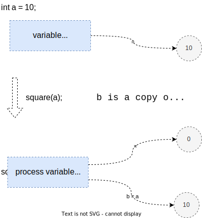

include::../../docs/settings.adoc[]
include::module-settings.adoc[]
:author: Thorsten Eckstein

// table of contents
:toc:

////
  Folgendes wird in "course-structure.adoc"
  aus jedem Modul zusammengeführt:

tag::content[]
----
1. Referenzsemantik
1.1. Wertsemantik - pass by value
1.2. Referenzsemantik - pass reference
----
end::content[]
////

== Referenzsemantik

Zu den grundlegenden Konzepten in jeder Programmiersprache gehören

. *Werte* und
. *Referenzen*.

In Java speichern *primitive* Variablen die tatsächlichen Werte, während *nicht-primitive* Variablen die Referenzen speichern, die auf die Adressen der Objekte verweisen.

Argumente werden in Java immer als _Wert_ übergeben. Während des Methodenaufrufs wird im Speicher eine Kopie jedes Arguments erstellt, unabhängig davon, ob es sich um einen Wert oder eine Referenz handelt, die dann an die Methode übergeben wird.

Bei Primitiven wird der Wert einfach in den Speicher kopiert und dann an die aufgerufene Methode übergeben, bei Nicht-Primitiven (komplexen) zeigt eine Referenz auf die tatsächlichen Daten (im Heap). Wenn ein Objekt übergeben wird, dann wird die Referenz kopiert und die neue Referenz an die Methode übergeben.

Dies sind zugleich die beiden häufigsten Arten der Übergabe von Argument an Methoden, also "Wertübergabe" und "Referenzübergabe". Verschiedene Programmiersprachen verwenden diese Konzepte allerdings auf unterschiedliche Weise.

Was Java betrifft, ist alles ausschließlich *Pass-by-Value* (auch wenn der _Wert_ eine Referenz ist).

=== Wertsemantik

[subs=normal]
 _"Variablen speichern Werte"_

Wenn es sich bei einem Parameter um eine Wertübergabe handelt, arbeiten die aufrufende und die aufgerufene Methode mit zwei verschiedenen Variablen, die Kopien voneinander sind. Jegliche Änderungen an einer Variablen verändern nicht die andere.

Dies bedeutet, dass beim Aufrufen einer Methode die an die aufgerufene Methode übergebenen Parameter *Klone* der ursprünglichen Parameter sind. Jede in der aufgerufenen Methode vorgenommene Änderung hat keine Auswirkungen auf die ursprünglichen Parameter in der aufrufenden Methode.

Ein Unit-Test Beispiel (*Demo 1*):

[, java, linenums, indent=0]
----
include::{mod-lnk-test}/semantics/SemanticsDemoTests.java[tags="ref-semantics-prim"]
----

Grafische Aufbereitung:

{nl}

=== Referenzsemantik

[subs=normal]
 _"Variablen speichern Referenzen"_

Wenn ein Methoden-Parameter als (Objekt-)*Referenz* übergeben wird, bearbeiten der Aufrufer und der Angerufene dieselbe (Objekt-)*Instanz*.

Dies bedeutet, dass bei der Übergabe einer Variablen als Referenz die eindeutige Kennung - quasi die "Adresse" des Objekts - an die Methode gesendet wird. Alle Änderungen an den Feldern des übergebenen Objektes führen dazu, dass diese Änderung am ursprünglichen Wert vorgenommen wird.

Ein Unit-Test Beispiel (*Demo 2*):

[, java, linenums, indent=0]
----
include::{mod-lnk-test}/semantics/SemanticsDemoTests.java[tags="ref-semantics-obj"]
----

Grafische Aufbereitung:

Un noch ein ausführliches Beispiel (*Demo 3*):

image::diagrams/reference-semantics.svg["RefSem",width="100%",align="center"]

[small]#_Quelle: -> https://stackoverflow.com/questions/40480/is-java-pass-by-reference-or-pass-by-value[Stackoverflow]_#

[cols="^1,9a", grid="none", frame="none"]
|===
| # | Erläuterung/Kommentar

| [yellow]#(1)#
| Erzeugung einer Variable `a1` vom Typ `Account` mit Zuweisung zur neuen Instanz sowie der Initialisierung des Attributes `amount` mit dem Wert `0`

[source,java,indent=0]
----
Account a1 = new Account();
----

| [yellow]#(2)#
| Aus Sicht der Methode `process(Account acc)` wird eine Variable `acc` definiert, sie hat initial den Wert `null`

[source,java,indent=0]
----
include::{mod-lnk-src}/semantics/demo/Account.java[lines="22"]
----

| [yellow]#(3)#
| Beim Aufruf der Methode `process(a1)` wird der Wert bzw. die "Adresse" der Variable `a1`  nach `acc` kopiert (_"copy-by-value"_)

[,java]
----
Account.process(a1)
----

| [yellow]#(4)#
| Hier wird (einfach) eine neue Instanz `a2` von `Account` angelegt, sie hat zunächst nichts mit den vorhergehenden Dingen zu tun. Bei dieser zweiten Instanz wird das Attribut `amount` allerdings gleich dem Wert `100` initialisiert

[source,java,indent=0]
----
include::{mod-lnk-src}/semantics/demo/Account.java[lines="24"]
----

| [yellow]#(5)#
| Bei der Zuweisung von `acc = a2` wird die Referenz auf die neue Instanz "gelenkt"

[source,java,indent=0]
----
include::{mod-lnk-src}/semantics/demo/Account.java[lines="25"]
----

| [yellow]#(6)#
| Hier wird der interne Status der Instanz von `Account`, nämlich der Attributwert von `amount` um `250` erhöht, der Objektzustand wird also verändert!

[source,java,indent=0]
----
include::{mod-lnk-src}/semantics/demo/Account.java[lines="27"]
----
|===

=== Übungen

Übungsaufgabe 1::

Stelle das ausführliche Beispiel oben (*Demo 3*) in Form eines Unit-Tests nach.

Übungsaufgabe 2::

Was passiert, wenn ein Objekt an eine Methode übergeben wird, und welche Bedeutung hat dies im Sinne der Referenzsemantik?

////
Diese Frage testet das Verständnis dafür, wie Java mit Objektreferenzen umgeht. Wenn ein Objekt an eine Methode übergeben wird, wird tatsächlich die Referenz auf das Objekt übergeben, nicht das eigentliche Objekt selbst. Das heißt, wenn die Methode das Objekt über die Referenz ändert, werden die Änderungen außerhalb der Methode widergespiegelt, da sie dasselbe zugrunde liegende Objekt im Speicher ändern.
////

Übungsaufgabe 3::

Stelle Wertsemantik und Referenzsemantik anhand einer Grafik gegenüber!

Übungsaufgabe 4::

Wie kann verhindert werden, dass Objekte (Objektinstanzen), die an Methoden übergeben werden, im Anschluss bzw. innerhalb der Methode verändert werden können?
