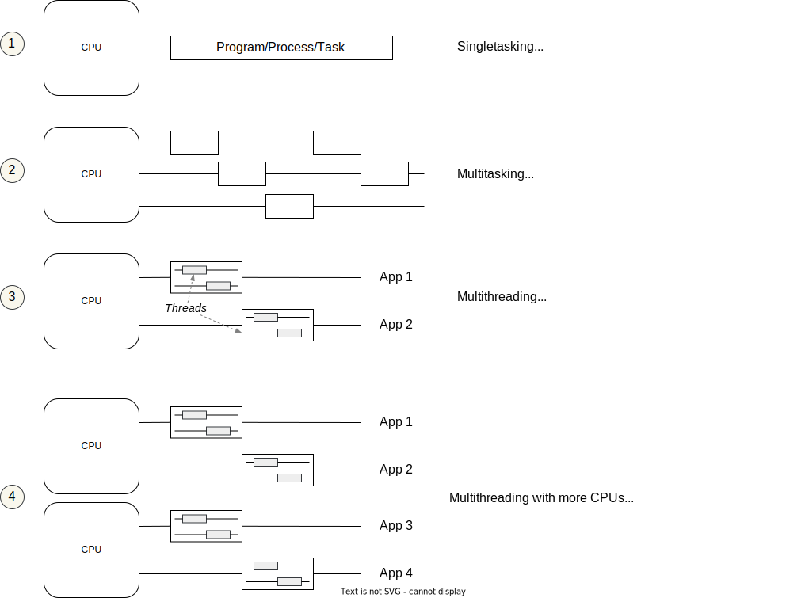

include::../../docs/settings.adoc[]
include::module-settings.adoc[]
:author: Thorsten Eckstein

:toc:

////
  Folgendes wird in "course-structure.adoc"
  aus jedem Modul zusammengeführt:

tag::content[]
----
1. Parallele Programmierung mit Threads
1.1. Thread & Runnable
1.2. Synchronized
----
end::content[]
////

== Parallele Programmierung mit Threads

=== Thread & Runnable

*Threads* erlauben einer Applikation mehrere Operationen gleichzeitig und effizient auszuführen. Das wird häufig genutzt, um komplexe, langwierige oder performanzlastige Operationen wie z.B. IO-Operationen im Hintergrund auszuführen, ohne dass der "Hauptablauf" der Applikation unterbrochen werden muss.

Threads durchschreiten einen Lebenszyklus, die den Beispielen finden sich Methodenaufrufe, die entsprechend den Zustandstransitionen benannt sind, z.B. `start()`.

.Thread Lifecycle
image::images/ThreadLifecycle.jpeg["Lifecycle",width="80%",align="center"]

Die wichtigsten *Klassen* für die Implementierung sind dabei

* `Thread` und
* `Runnable`

Dazu ein paar Begriffe & Erläuterungen als Übersicht:

Beispiele für die Erzeugung, Start und Stopp finden sich im Package

[subs=normal]
 {mod-ref-src}/threads (/ex1 bis /ex8)

=== Synchronized

Vereinfacht ausgedrückt können, in einer _multi-threaded_ Umgebung, sogenannte *race conditions* vorkommen, wenn zwei oder mehr Threads zur gleichen Zeit versuchen, Daten zu aktualisieren, die in einem gemeinsam genutzten Speicher vorhanden sind.

Java bietet zur Vermeidung dieses Problems den Mechanismus der *Synchronisierung* bzw. des *synchronisierten Zugriffs auf geteilte Daten* durch Threads an.

Durch die Verwendung von des Schlüsselwortes `synchronized` kann nur ein einziger Thread auf den markierten Codeabschnitt (oder die Methode) zugreifen, er hat sozusagen exklusiven Zugriff für dessen Prozessierung.

Dazu gibt es im Wesentlichen zwei Wege:

1. In der *Methodensignatur*

[source, java, lines]
----
public synchronized File load(String fileName) {
    // code that loads the specified file
    // ...
}
----

1. Als *Codeblock*

[source, java, lines]
----
public File load(String fileName) {
    synchronized(this) {
        // code that loads the specified file
        // ...
    }
}
----
[small]#_Zeile 2: `this` ist die Referenz auf die Instanz der umgebenden Klasse (das Monitor-Objekt)_#

Siehe auch:
[source, java, lines, indent=0]
----
include::{mod-lnk-test}/demo/ThreadsDemoTests.java[tags="synchronized-list"]
----

