include::../../docs/settings.adoc[]
include::module-settings.adoc[]
:author: Thorsten Eckstein

// table of contents
:toc:

////
  Folgendes wird in "course-structure.adoc"
  aus jedem Modul zusammengeführt:

tag::content[]
----
1. Projektverwaltung mit Maven & Projektstruktur
2. Test-Driven-Development (TDD)
3. Generierung von Quellcode mit der IDE
4. Autocompletion
5. Icons & Symbole in der IDE
6. Tipps, Tricks, Probleme & Lösungen
----
end::content[]
////

== Projektverwaltung mit `Maven` & Projektstruktur

Das Projekt bzw. jedes `Modul` dieser Lehrveranstaltung hat eine ähnliche Struktur, die die Nutzung vereinfacht und die *Wiedererkennbarkeit* verbessert:

Im *Allgemeinen*:

[subs=normal]
----
{icon-dir} <Projekt-Wurzel>
  {icon-dir} <Modul-Wurzel>
    {icon-dir} docs        -> Dokumentation zum Modul
    {icon-dir} src         -> Wurzel für den gesamten Sourcecode
      {icon-dir} main      -> Wurzel für den "produktiven" Sourcecode
        {icon-dir-src} java ...
      {icon-dir-test} test      -> Wurzel für den Test-Sourcecode
        {icon-dir-src} java ...
    {icon-dir-target} target      -> Kompilierte Klassen
----

Am *Beispiel* des ersten Moduls `module-classes`:

[subs=normal]
----
{icon-dir} D:\Projekte\JavaProgammierung
  {icon-dir} module-classes
    {icon-dir} docs
    {icon-dir} src
      {icon-dir} main
        {icon-dir-src} java              -> ab hier "Package" Verzeichnisse
          {icon-dir-package} de
            {icon-dir-package} dhbw
              {icon-dir-package} demo        -> Klassen zur Demonstration,
                               ggf. mit Unterverzeichnissen
              {icon-dir-package} exercise    -> Klassen, die im Rahmen von Tests
                               implementiert werden
              {icon-dir-package} solution    -> Klassen, die Lösungen für die Tests sind
      {icon-dir-test} test
        {icon-dir-src} java
          {icon-dir-package} de
             ...
    {icon-dir-target} target
----

Ein sehr weit verbreitetes Framework bzw. Tool zur Erzeugung solcher Projektstrukturen ist das bekannte `Maven` (Alternative `Gradle`).

Die Erstellung einer Software beinhaltet viele Voraussetzungen, aber noch vor Beginn der Implementierung sollte man sich über ein paar Grundlagen Gedanken machen.

Dazu gehört das *Build- & Dependency Management*. Aus diesem Grund wird Maven auch als *Dependency Management Tool* bezeichnet.

-> https://maven.apache.org

Es erleichtert an dieser Stelle u.a. ...

- die Verwaltung von _Dependencies_,
- die Verwaltung des _Classpath_,
- den _Compile_ des Projektes,
- die _Konfiguration_,
- den _Build_ des Projektes und nicht zuletzt
- das _Deployment_ des Liefergegenstandes (Deliverable)
- es ermöglicht Erweiterungen durch PlugIns
- ... und viele weitere Aspekte

Das Tool verfolgt das Konzept

 Convention over Configuration

das eine geringst mögliche *Grundkonfiguration* ermöglicht, weil das Tool einfach eine Reihe von Annahmen trifft, die für sehr viele Projekte allgemein anerkannt sind und häufig genutzt werden. Erst wenn von diesen _Konventionen_ abgewichen werden muss, kann das Projekt entsprechend _konfiguriert_ werden.

Die wichtigste Datei für Maven ist das *`Project Object Model`* in Form der Datei

 pom.xml

die sowohl im Gesamtprojekt als auch im Wurzelverzeichnis jeden Moduls zu finden ist (sh. nachfolgend "parent-child-Beziehung"). Diese werden von vielen *IDEs* automatisch erkannt und beim Laden des Projektes für die Projektkonfiguration genutzt.

Bei hierarchischen Projektstrukturen wie in diesem Kurs gibt es mehrere POMs innerhalb der Hierarchie, sogenannte _parent_ und _child_ POMs, die zusammen gehören (-> vgl. Repository zu dieser LV).

*Nutzung von Maven*

Das Projekt sollte jetzt einmal insgesamt "gebaut" werden:

* entweder über das User-Interface von `IntelliJ`
* oder über die Kommandozeile

Am besten einfach in IntelliJ:

* Rechts oben am Rand von IntelliJ gibt es ein Symbol `_m_` (=maven), das öffnet die Standard Maven-View -> *(1)*

* Dann gibt es ein Symbol zur Ausführung von Maven -> *(2)*
* darauf hin öffnet sich ein modales Fenster, hier gibt man

 mvn clean compile

in der Kommandozeile ein oder macht das über die *GUI* -> *(3a)* oder *(3b)*

[cols="1a,1a,1a",grid="none",frame="none"]
|===
^| (1) ^| (2) ^| (3a)
| image::images/maven-view.png[]
| image::images/execute-maven-goal.png[]
| image::images/mvn-clean-compile.png[]
oder *(3b)*

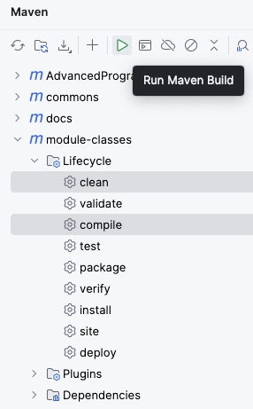
|===

Das Projekt sollte jetzt insgesamt *"bauen"*, d.h. die Sourcen _kompilieren_ und _assembeln_ (`/target` Ordner, spiel hier aber keine Rolle). Im unteren Bereich von IntelliJ öffnet sich automatisch eine Console und das "Build" Ergebnis wird angezeigt ... hoffentlich [green]#*SUCCESS*# für alle Module ;-) ...

[[tdd]]
== Test-Driven-Development (`TDD`)

////
====
_Kann übersprungen werden, wird vor den ersten Demo's bzw. Übungen zu "Klassen & Instanzen" vertieft._
====
////

Test Driven Development (`TDD`) ist eine gute Praxis, um den Sourcecode von Beginn an - mithilfe von Unit-Tests regelmäßig und bei Änderungen auf Korrektheit zu überprüfen. Die erste Umsetzung erfolgt vielfach durch Testklassen, den `Unit-Tests`.

Unit-Tests haben folgende *Eigenschaften*:

. Unit-Tests sind *automatisiert*. Ein Unit-Test-Framework führt Tests aus, verifiziert und gibt das Ergebnis zurück, damit es geprüft werden kann
. Unit-Tests sind *granular*, sie sollen nur einen kleinen Teil des Codes -häufig eine Methode - testen.
. Unit-Tests *isolieren* das Testziel und sollen möglichst ohne oder nur mit wenig "Vorbereitungen" gestartet werden können
. Unit-Tests sind *deterministisch*, damit das Testergebnis sauber geprüft werden kann und wiederholt werden kann
. Unit-Tests sind *unabhängig*. Die Ausführung der Tests dürfen in keiner Weise von anderen Testmethoden abhängen, denn die Reihenfolge der vom Framework ausgeführten Tests ist zufällig bzw. nicht vorhersagbar.

*Umsetzung*:

Unit-Tests weisen eine besondere (innere) Struktur auf, d.h. die Art und Weise, wie diese geschrieben werden. Dazu zählen

* `given-when-then` oder
* `arrange-act-assert`.

*Vorgehensweise*:

Auch das Schreiben von Tests folgt vielfach einer Routine bzw. einer "best practice". Neben zahlreichen gleichwertigen Ansätzen ist die so-genannte `"red, green, refactor"` Methode weitestgehend anerkannt.

[small]#_Quelle:-> https://www.informatik-aktuell.de/entwicklung/methoden/tdd-erfahrungen-bei-der-einfuehrung.html[Informatik Aktuell]_#

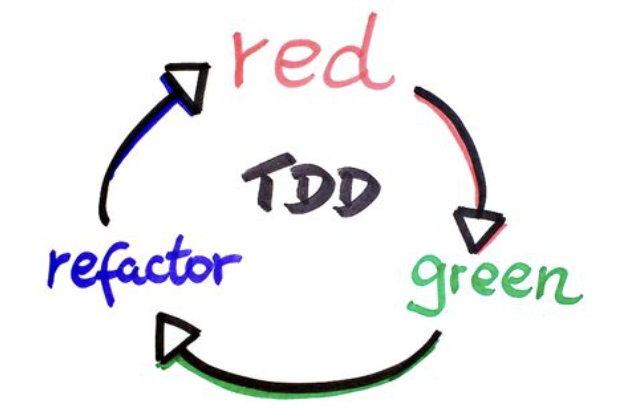

*Red, Green, Refactor*:

Der "red, green, refactor" Ansatz hilft Entwicklern, den (zu implementierenden) Code zu entwickeln, indem sie den Fokus in den Phasen auf bestimmte Aspekte lenken:

. [red]#*Red*#: _Was soll implementiert werden und wie fühlt sich das Ganze aus Sicht des "Clients" bzw. der Nutzer an?_ Nutzer sind hier primär die Entwickler selbst bzw. diejenigen, die die Klassen, Methoden, Algorithmen im Code aufrufen, also nutzen wollen. In dieser Phase _soll_ der Test noch scheitern, d.h. "rot" sein, weil hier nicht die Implementierung an sich, sondern die "Außensicht" auf die `API` im Vordergrund steht.

. [green]#*Green*#: In dieser Phase geht es darum, den Test _"zum Laufen"_ zu bringen. Es wird also "grün". Im Vordergrund steht die _schnellste und einfachste Implementierung_ der Funktionalität. Der Code wird hier also nur technisch funktionsfähig gemacht, es werden aber so wenig wie möglich Überlegungen angestellt, wie der Code gut, schön oder effektiv geschrieben werden muss.

. [blue]#*Refactor*#: In dieser letzten Phase (dieser Iteration) geht es nun genau darum, was in den beiden vorherigen Phasen absichtlich nicht gemacht werden sollte, nämlich die Verbesserung des Codes hinsichtlich seiner "Qualität" (das Thema Code-Qualität wird gegen Ende des Seminars noch näher betrachtet). Ergebnis dieser (drei) Phasen soll dann ein Unit-Test sein, der lesbar und wartbar ist und auch die Implementierung der Funktionalität einen bestimmten Reifegrad bzw. eine erste hinreichende Qualität erreicht hat, und natürlich letztlich die korrekte Funktionalität liefert.

[[demos_tdd]]
Dazu eine *Demo*:

[subs=normal]
 -> {mod-ref-test}/demo/tdd/TddDemoTest.java

== Generierung von Quellcode mit der IDE

In aller Regel ist es sehr sinnvoll, die Entwicklungsumgebung (IDE) weitreichend zu nutzen. Das gilt insbesondere für die *Erzeugung von Quellcode*. Das Ganze ist grundsätzlich eine Sache der Übung, man sollte sich einfach daran gewöhnen, diese Hilfen möglichst viel als Entwickler:In zu nutzen!

Ein paar *Tipps* dazu:

//tag::code-generation-keys[]
*Generierung von Quellcode (Klassen, Methoden, etc.)*

. mithilfe einer *Tastenkombination*
.. unter MacOS: `Command + N`
.. unter Windows: `Alt + Einfg` (ggf. auch `Fn + Alt + Einfg`) oder
. mithilfe der *Maus*
//end::code-generation-keys[]

// grid="none", frame="none"
[cols="^1,^1", grid="none", frame="none"]
|===
| An der Cursorposition "Rechts-Klick" > `Generate ...`
| An der Cursorposition > IntelliJ-Menü `Code` > `Generate ...`

| 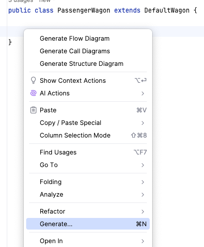
| 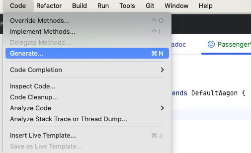
|===

Hier wählt man dann einfach die gewünschte *kontext-spezifische* Funktion:

[cols="^1,^1", grid="none", frame="none"]
|===

| z.B. die Generierung von Methoden _"Getter & Setter"_
| oder die Implementierung von Interface-Methoden bzw.
die sog. _Overrides_ bei Vererbungen

| 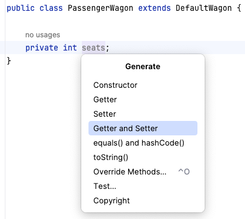
| 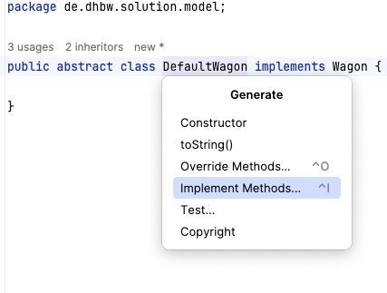
|===

== Autocompletion

Neben der Generierung von Code ist auch die Unterstützung beim Tippen durch die sog. *Autocompletion*, also die automatische Ergänzung/Erkennung des gerade getippten Codes, von besonderer Bedeutung.

Die IDE gibt insgesamt sehr viele, leider zum Teil recht minimalistische, Hinweise und Informationen zum aktuellen "Geschehen" während der Programmierung. Dazu gehören u.a.:

Hier wählt man dann einfach die gewünschte *kontext-spezifische* Funktion:

[cols="^1,^1", grid="none", frame="none"]
|===

| Anzeige von möglichen Methoden einer Instanz
| Auswahlmöglichkeiten für nutzbare Typen, hier Klassen

| 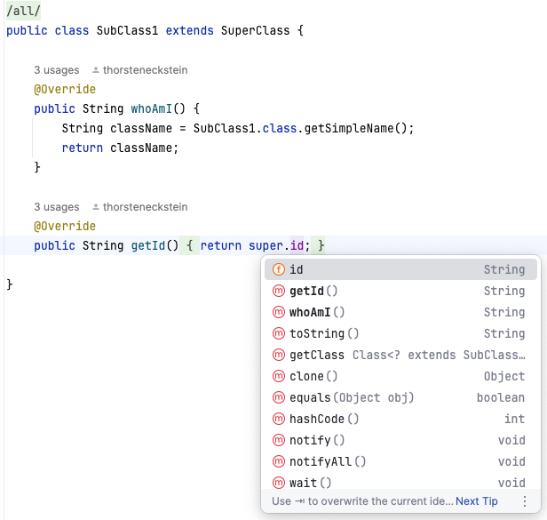
| 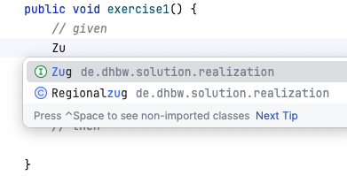
|===

== Icons & Symbole in der IDE

Die _"kleinen Hinweise"_ der IDE helfen dem geübten Auge mit schnellen Informationen. Dazu ein paar Beispiele, wenn man mit der Maus über das jeweilige Symbol fährt:

[cols="^1,9"]
|===
| Symbol | Symbol (am linken Editor-Rand) & Bedeutung

| 
| 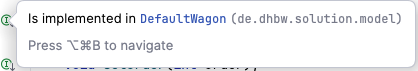

| 
| 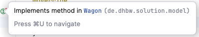

| 
| 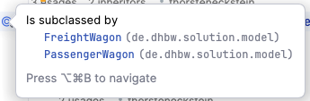
|===

Darüber hinaus gibt es viele weitere Infos, deshalb ...

TIP: Einfach ausprobieren und die Maus über alles Mögliche "hovern" ;-)

== Tipps, Tricks, Probleme & Lösungen

=== Die Anzeige von Diagrammen in AsciiDoc Dokumenten schlägt fehl

Fehlermeldung im Diagram signalisiert, dass das Tool `graphviz` fehlt.

Dieses Tool muss ...

. zuerst installiert werden -> https://graphviz.org/download/[https://graphviz.org/download/] und dann
. in IntelliJ für das PlugIn AsciiDoc bekannt gemacht werden, durch Angabe des Pfades zur `dot` Ausführungsdatei (z.B. `dot.exe`)

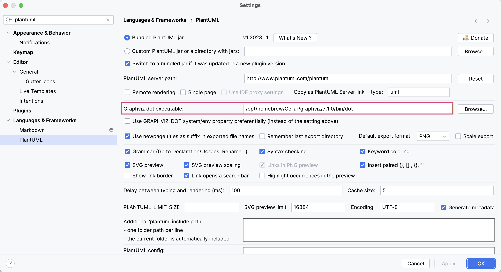

IMPORTANT: Die Pfade im obigen Bild sind MacOS Pfade, unter `Windows` sehen diese etwas anders aus!
